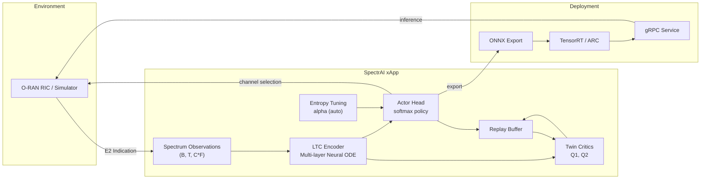

# SpectrAI — AI-Native Dynamic Spectrum Management for O-RAN

[](https://github.com/spectrai-project/spectrai/actions/workflows/ci.yaml)
[](https://opensource.org/licenses/Apache-2.0)
[](https://www.python.org/)
[](https://ghcr.io)

---

## Overview

**SpectrAI** is a production-grade O-RAN xApp that performs real-time Dynamic
Spectrum Access (DSA) using a novel reinforcement learning architecture:
**SAC-LTC** — Soft Actor-Critic with Liquid Time-Constant network encoders.

Traditional DSA agents use fixed-timescale recurrent networks (LSTM) or
attention-based models (Transformers) to process spectrum observations. Neither
adapts its temporal integration speed to the current radio environment. SpectrAI
solves this with **Liquid Time-Constant (LTC) cells** — biologically-inspired
neural ODE modules whose time constants are *input-dependent*:

```
tau(x) = tau_base + softplus(W_tau * x + b_tau)
```

When channel dynamics change rapidly (frequent PU transitions, high
interference), `tau` decreases and the agent integrates new observations faster.
During stable periods, `tau` increases, retaining longer-term memory. This
continuous-time ODE formulation directly matches the Markov process structure of
real-world PU occupancy.

### Key Results

| Metric | SAC-LTC | SAC-LSTM | SAC-LFM | PPO-LSTM |
|---|---|---|---|---|
| **Success Rate** | **63.37%** | 62.51% | 62.73% | 62.62% |
| **Collision Rate** | **36.63%** | 37.49% | 37.27% | 37.38% |
| **Spectral Efficiency** | **0.634** | 0.625 | 0.627 | 0.626 |
| **Inference Latency** | 1.58 ms | 0.83 ms | 1.28 ms | 4.11 ms |

Full benchmark methodology and per-seed breakdowns are available in
[`benchmarks/`](benchmarks/).

---

## Architecture



### LTC Cell (Core Module)

Each LTC cell implements a single discretised ODE step:

```python
f = tanh(W_h * h + W_x * x + b)          # nonlinear target
tau = tau_base + softplus(W_tau * x)       # input-dependent time constant
h_new = h + (dt / tau) * (-h + f)         # Euler ODE step
```

The multi-layer LTC encoder processes spectrum observation sequences step by
step, producing a fixed-dimensional latent representation `z` that feeds both
the actor (policy) and twin critic (Q-value) heads of the SAC algorithm.

---

## Quick Start

### Installation

```bash
# From source
git clone https://github.com/spectrai-project/spectrai.git
cd spectrai
pip install -e ".[dev]"

# Verify installation
pytest tests/ -v
```

### Train

```bash
# Train SAC-LTC on the simulated DSA environment
python scripts/train.py --num_steps 50000 --seed 42

# Custom configuration
python scripts/train.py \
    --num_channels 20 \
    --hidden_dim 128 \
    --latent_dim 128 \
    --num_layers 2 \
    --batch_size 256 \
    --output_dir results/run1
```

### Export to ONNX

```python
from spectrai.export import export_actor_to_onnx

export_actor_to_onnx(
    actor=agent.actor,
    input_shape=(16, 30),          # (sequence_length, num_channels * num_features)
    output_path="models/actor.onnx",
)
```

### Serve via gRPC

```bash
# Start the inference server (requires ONNX model)
python -m spectrai.xapp.server --model models/actor.onnx --port 50051
```

---

## Deployment

### Docker

```bash
# Build
docker build -f docker/Dockerfile -t spectrai:latest .

# Run training
docker run --rm spectrai:latest python scripts/train.py --num_steps 100000

# Run inference server
docker run --rm -p 50051:50051 spectrai:latest \
    python -m spectrai.xapp.server --model /app/models/actor.onnx
```

### O-RAN RIC

SpectrAI is designed to run as an xApp on O-RAN-compliant near-RT RICs:

1. **Register** the xApp with the RIC platform via `ricxappframe`.
2. **Subscribe** to E2 indications carrying spectrum measurements.
3. **Infer** channel selections using the exported ONNX/TensorRT model.
4. **Control** via E2 control messages back to the E2 node.

See [`src/spectrai/xapp/`](src/spectrai/xapp/) for the xApp integration layer.

### NVIDIA ARC

For GPU-accelerated inference on NVIDIA Aerial RAN CoProcessors:

1. Export the actor to ONNX (`export_actor_to_onnx`).
2. Convert to TensorRT using `trtexec`.
3. Deploy the TensorRT engine behind the gRPC server.

Install GPU dependencies: `pip install spectrai[gpu]`

---

## Configuration

SpectrAI uses a Pydantic-validated configuration schema. Key options:

| Section | Parameter | Default | Description |
|---|---|---|---|
| `environment` | `num_channels` | 10 | Number of radio channels |
| `environment` | `sequence_length` | 16 | Observation history window |
| `environment` | `num_features` | 3 | Features per channel (SNR, interference, occupancy) |
| `encoder` | `hidden_dim` | 128 | LTC cell hidden state dimension |
| `encoder` | `latent_dim` | 128 | Encoder output dimension |
| `encoder` | `num_layers` | 2 | Number of stacked LTC layers |
| `encoder` | `dt` | 1.0 | ODE discretisation step size |
| `agent` | `lr` | 3e-4 | Learning rate for all optimizers |
| `agent` | `gamma` | 0.99 | Discount factor |
| `agent` | `tau` | 0.005 | Polyak averaging coefficient |
| `agent` | `buffer_size` | 1,000,000 | Replay buffer capacity |
| `agent` | `batch_size` | 256 | Mini-batch size |

Load from YAML:

```python
from spectrai.config import SpectralConfig

cfg = SpectralConfig.from_yaml_file("config.yaml")
```

---

## Benchmarks

Full benchmark results comparing SAC-LTC against SAC-LSTM, SAC-LFM, and
PPO-LSTM are in [`benchmarks/`](benchmarks/). Summary:

| Metric | SAC-LTC | SAC-LFM | SAC-LSTM | PPO-LSTM |
|---|---|---|---|---|
| Mean Reward | 38.33 +/- 2.18 | 35.85 +/- 2.37 | 50.03 +/- 1.88 | 49.51 +/- 1.33 |
| Success Rate | **63.37% +/- 0.44%** | 62.73% +/- 0.56% | 62.51% +/- 0.47% | 62.62% +/- 0.55% |
| Collision Rate | **36.63% +/- 0.44%** | 37.27% +/- 0.56% | 37.49% +/- 0.47% | 37.38% +/- 0.55% |
| Spectral Efficiency | **0.634 +/- 0.004** | 0.627 +/- 0.006 | 0.625 +/- 0.005 | 0.626 +/- 0.005 |
| Jain's Fairness | 0.996 +/- 0.001 | 0.996 +/- 0.000 | 0.995 +/- 0.001 | 0.995 +/- 0.000 |
| Inference Latency | 1.58 ms | 1.28 ms | 0.83 ms | 4.11 ms |

Reproduce with:

```bash
pip install -e ".[benchmarks]"
python benchmarks/run_full_benchmark.py --config benchmarks/benchmark_config.yaml
python benchmarks/visualize.py --results_dir benchmarks/results
```

---

## API

SpectrAI exposes a gRPC service for real-time inference:

```protobuf
service SpectrAI {
    // Single-shot channel selection
    rpc SelectChannel (SpectrumObservation) returns (ChannelDecision);

    // Streaming spectrum observations
    rpc StreamDecisions (stream SpectrumObservation) returns (stream ChannelDecision);

    // Health check
    rpc GetStatus (Empty) returns (ServiceStatus);
}
```

See [`proto/`](proto/) for the full service definition.

---

## Project Structure

```
SAC-LTC/
├── src/spectrai/
│   ├── core/           # LTC cell, encoder, actor, critic, replay buffer
│   ├── agent/          # SAC-LTC agent
│   ├── env/            # Gymnasium environments (sim, O-RAN, AODT)
│   ├── export/         # ONNX / TensorRT export
│   ├── xapp/           # O-RAN xApp integration
│   ├── config.py       # Pydantic configuration schema
│   └── monitoring/     # Prometheus metrics
├── tests/              # pytest test suite
├── scripts/            # Training and evaluation scripts
├── benchmarks/         # Reproducible benchmark suite
├── proto/              # gRPC / Protobuf definitions
├── docker/             # Dockerfile for deployment
└── pyproject.toml      # Package configuration
```

---

## Citation

```bibtex
@inproceedings{sac-ltc-dsa,
  title={SAC-LTC: Soft Actor-Critic with Liquid Time-Constant Networks
         for Dynamic Spectrum Access},
  year={2025},
  note={Liquid Time-Constant networks for adaptive temporal modelling
        in cognitive radio}
}
```

## References

- Hasani, R., Lechner, M., Amini, A., et al. "Liquid Time-constant Networks." *AAAI*, 2021.
- Christodoulou, P. "Soft Actor-Critic for Discrete Action Settings." *arXiv:1910.07207*, 2019.
- Haarnoja, T., Zhou, A., Abbeel, P., Levine, S. "Soft Actor-Critic: Off-Policy Maximum Entropy Deep Reinforcement Learning." *ICML*, 2018.

## License

Apache 2.0 — see [LICENSE](LICENSE) for details.
