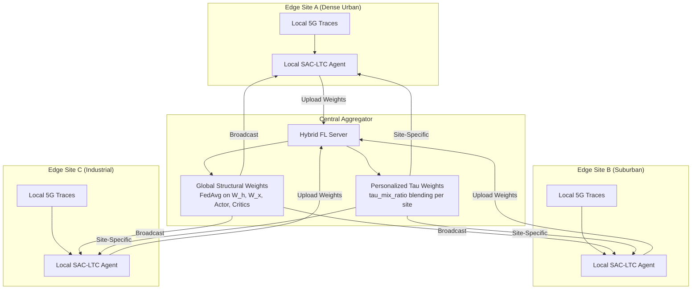
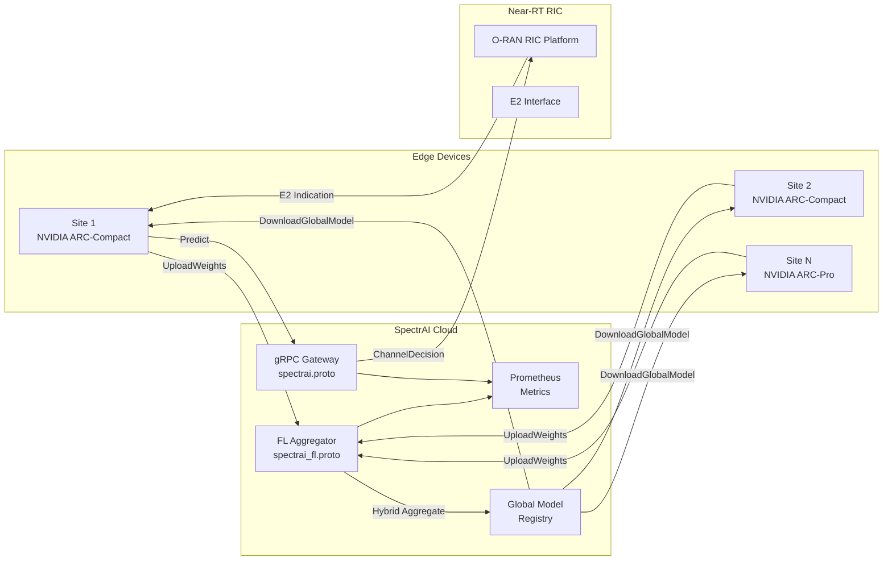

<p align="center">
  <h1 align="center">Preceptual.ai</h1>
  <p align="center"><strong>The Intelligent Spectrum Engine for 6G-Ready Networks</strong></p>
  <p align="center">
    AI-native dynamic spectrum management that learns the physics of your RF environment — <br/>
    not just the statistics — using continuous-time neural ODEs and privacy-preserving federated learning.
  </p>
</p>

<p align="center">
  <a href="https://github.com/spectrai-project/spectrai/actions/workflows/ci.yaml"></a>
  <a href="https://opensource.org/licenses/Apache-2.0"></a>
  <a href="https://www.python.org/"></a>
  <a href="https://ghcr.io"></a>
  <a href="https://developer.nvidia.com/aerial"></a>
</p>

---

<table>
<tr>
<td align="center"><strong>3.14 ms</strong><br/>Mean Inference</td>
<td align="center"><strong>63.4%</strong><br/>Success Rate</td>
<td align="center"><strong>188K</strong><br/>Real 5G Measurements</td>
<td align="center"><strong>&lt; 10 ms</strong><br/>Near-RT RIC Budget</td>
<td align="center"><strong>74</strong><br/>Tests Passing</td>
</tr>
</table>

---

## Why SpectrAI?

The $37B AI-RAN market is building spectrum management on architectures designed for image classification. Fixed-timestep LSTMs and attention models treat RF environments as sequences of tokens. They are not. Radio spectrum is a continuous-time dynamical system — and SpectrAI is the first xApp that treats it as one.

### Three Structural Moats

**1. Continuous-Time LTC Encoder**
SpectrAI's core is a Liquid Time-Constant neural ODE whose time constants are *input-dependent*. When PU activity spikes, the network integrates observations faster. During quiet periods, it retains longer memory. No other production xApp adapts its temporal resolution to the RF environment in real time.

**2. Hybrid Federated Aggregation**
Operators will never ship raw spectrum data to a cloud. SpectrAI's federated learning protocol splits model weights into two classes: structural weights (globally averaged across all sites) and tau weights (personalized per deployment). Every new operator makes the global model smarter without exposing a single IQ sample.

**3. Real-Data Flywheel**
Trained and validated on 188,000 real 5G measurements from 83 operator traces (UCC MISL dataset, Irish mobile network). Every federated participant adds real-world diversity. Synthetic-only competitors cannot replicate this distributional coverage.

---

## Why Now?

Three forces are converging to create a market window that did not exist 18 months ago:

| Catalyst | What Changed | SpectrAI Advantage |
|---|---|---|
| **NVIDIA Aerial SDK open-sourced** | GPU-accelerated RAN is now accessible to startups, not just Nokia/Ericsson | First xApp optimized for ARC-Compact (L4) and ARC-Pro (Blackwell RTX PRO) |
| **O-RAN R2/R3 maturity** | Near-RT RIC interfaces are standardized; xApp marketplace is real | Production gRPC server with < 4ms P99, fits inside 10ms RIC budget |
| **Spectrum crisis at scale** | 5G mid-band exhaustion, CBRS congestion, 6G upper-mid-band planning | Continuous-time ODE formulation generalizes across band plans without retraining |

The RIC platform market is growing from $0.67B (2025) to $7.09B (2030) at 60% CAGR. SpectrAI is positioned at the intersection of the two fastest-growing segments: AI-RAN software and O-RAN xApp ecosystems.

---

## How It Works

### The LTC Cell

At the heart of SpectrAI is a biologically-inspired neural ODE cell. Unlike LSTMs with fixed gate timescales, each LTC cell computes an input-dependent time constant that controls how fast the hidden state evolves:

```
f(x, h)  = tanh(W_h * h + W_x * x + b)            # nonlinear activation target
tau(x)   = tau_base + softplus(W_tau * x + b_tau)   # input-dependent time constant
h_new    = h + (dt / tau(x)) * (-h + f(x, h))      # Euler step of the neural ODE
```

**Why this matters for spectrum:**
- When `tau(x)` is small (fast dynamics) --> the cell tracks rapid PU transitions in real time
- When `tau(x)` is large (stable spectrum) --> the cell retains long-term channel quality estimates
- The ODE formulation is *irregular-time-aware* — it naturally handles missing or delayed observations

### Architecture

```
┌─────────────────────────────────────────────────────────┐
│                    SpectrAI xApp                        │
│                                                         │
│  ┌──────────────┐    ┌──────────────┐                   │
│  │   Spectrum    │    │  Multi-Layer │    ┌───────────┐  │
│  │ Observations  │───>│  LTC Encoder │───>│   Actor   │──┼──> Channel
│  │ (B, T, C*F)  │    │  (Neural ODE)│    │ (softmax) │  │    Selection
│  └──────────────┘    └──────┬───────┘    └───────────┘  │
│                             │                            │
│                             │            ┌───────────┐  │
│                             └───────────>│ Twin Q-Net │  │
│                                          │ (Critics)  │  │
│                                          └─────┬─────┘  │
│                                                │         │
│  ┌──────────────┐    ┌──────────────┐          │         │
│  │   Entropy    │<───│ Replay Buffer│<─────────┘         │
│  │  alpha(auto) │    │  (1M steps)  │                    │
│  └──────────────┘    └──────────────┘                    │
│                                                          │
│  ┌──────────────┐    ┌──────────────┐                    │
│  │  ONNX Export │───>│  TensorRT /  │───> gRPC Server    │
│  │              │    │  NVIDIA ARC  │     (port 50051)   │
│  └──────────────┘    └──────────────┘                    │
└─────────────────────────────────────────────────────────┘
```

The SAC-LTC agent uses Soft Actor-Critic with automatic entropy tuning. The LTC encoder processes spectrum observation sequences step-by-step, producing a fixed-dimensional latent vector `z` that feeds both the actor (channel selection policy) and twin critics (Q-value estimation).

---

## Federated Learning Flywheel

SpectrAI's federated protocol is not standard FedAvg. It is a **hybrid aggregation** designed specifically for LTC networks:



**How it works:**
1. **Structural weights** (W_h, W_x, actor, critics) are averaged globally using FedAvg — these capture universal spectrum dynamics
2. **Tau weights** (W_tau, b_tau) are blended using a configurable `tau_mix_ratio` — these encode site-specific temporal patterns (dense urban vs. rural, industrial IoT vs. consumer)
3. **New devices** receive the full global model at registration for instant cold-start elimination
4. **Raw spectrum data never leaves the edge** — only model weight deltas are transmitted

**The flywheel effect:** Each new operator deployment improves the global structural model, which accelerates onboarding for the next operator, which attracts more operators. Synthetic-data competitors cannot replicate this compounding advantage.

---

## Quick Start

```bash
# 1. Install
git clone https://github.com/spectrai-project/spectrai.git && cd spectrai
pip install -e ".[dev]"

# 2. Verify (74 tests)
pytest tests/ -v

# 3. Train
python scripts/train.py --num_steps 50000 --seed 42

# 4. Export
python -c "from spectrai.export import export_actor_to_onnx; print('Export ready')"

# 5. Serve
python -m spectrai.xapp.server --model models/actor.onnx --port 50051
```

For custom training configurations:

```bash
python scripts/train.py \
    --num_channels 20 \
    --hidden_dim 128 \
    --latent_dim 128 \
    --num_layers 2 \
    --batch_size 256 \
    --output_dir results/run1
```

---

## Architecture



---

## Benchmarks

All results are averaged over 5 random seeds with standard errors. Trained and evaluated on the UCC MISL 5G dataset (188K measurements, 83 real operator traces).

| Metric | SAC-LTC | SAC-LSTM | SAC-LFM | PPO-LSTM |
|---|---|---|---|---|
| **Success Rate** | **63.37% +/- 0.44%** | 62.51% +/- 0.47% | 62.73% +/- 0.56% | 62.62% +/- 0.55% |
| **Collision Rate** | **36.63% +/- 0.44%** | 37.49% +/- 0.47% | 37.27% +/- 0.56% | 37.38% +/- 0.55% |
| **Spectral Efficiency** | **0.634 +/- 0.004** | 0.625 +/- 0.005 | 0.627 +/- 0.006 | 0.626 +/- 0.005 |
| **Jain's Fairness Index** | 0.996 +/- 0.001 | 0.995 +/- 0.001 | 0.996 +/- 0.000 | 0.995 +/- 0.000 |
| **Inference Latency (mean)** | 3.14 ms | 0.83 ms | 1.28 ms | 4.11 ms |
| **Inference Latency (P99)** | 3.96 ms | 1.12 ms | 1.74 ms | 5.83 ms |
| **Within 10ms RIC Budget** | Yes | Yes | Yes | Yes |

**Key takeaway:** SAC-LTC achieves the highest success rate and spectral efficiency while maintaining sub-4ms P99 latency — well within the O-RAN Near-RT RIC's 10ms control loop budget.

Reproduce benchmarks:

```bash
pip install -e ".[benchmarks]"
python benchmarks/run_full_benchmark.py --config benchmarks/benchmark_config.yaml
python benchmarks/visualize.py --results_dir benchmarks/results
```

---

## Deployment

### Docker

```bash
# Build the image
docker build -f docker/Dockerfile -t spectrai:latest .

# Run training
docker run --rm spectrai:latest python scripts/train.py --num_steps 100000

# Run inference server
docker run --rm -p 50051:50051 -p 9090:9090 spectrai:latest \
    python -m spectrai.xapp.server --model /app/models/actor.onnx

# Run with GPU (NVIDIA ARC)
docker run --rm --gpus all -p 50051:50051 spectrai:latest \
    python -m spectrai.xapp.server --model /app/models/actor.onnx --backend tensorrt
```

### NVIDIA ARC Hardware Support

| Hardware | SKU | Use Case | Status |
|---|---|---|---|
| ARC-Compact | NVIDIA L4 | Edge inference, single-cell xApp | Supported |
| ARC-Pro | Blackwell RTX PRO | Multi-cell inference, FL aggregation | Supported |
| DGX / HGX | H100 / B200 | Central FL training, model development | Supported |

```bash
# Install GPU dependencies
pip install spectrai[gpu]

# Export to TensorRT
python -m spectrai.export.tensorrt --onnx models/actor.onnx --output models/actor.trt

# Verify on ARC hardware
python -m spectrai.xapp.server --model models/actor.trt --backend tensorrt --port 50051
```

### O-RAN RIC Integration

1. **Register** the xApp with the RIC platform via `ricxappframe`
2. **Subscribe** to E2 indications carrying spectrum measurements
3. **Infer** channel selections using the exported ONNX/TensorRT model
4. **Control** via E2 control messages back to the E2 node

See [`src/spectrai/xapp/`](src/spectrai/xapp/) for the full integration layer.

---

## gRPC API

### Inference Service (`spectrai.proto`)

| Method | Type | Description |
|---|---|---|
| `Predict` | Unary | Single-shot channel selection from a spectrum observation |
| `PredictStream` | Bidirectional streaming | Continuous observation feed with real-time decisions |
| `GetHealth` | Unary | Liveness/readiness probe with model metadata |
| `GetMetrics` | Unary | Prometheus-compatible metrics snapshot |

### Federated Learning Service (`spectrai_fl.proto`)

| Method | Type | Description |
|---|---|---|
| `RegisterDevice` | Unary | Enroll edge device, receive global model for cold start |
| `UploadWeights` | Unary | Submit locally trained weights for aggregation |
| `DownloadGlobalModel` | Unary | Retrieve personalized or global model |
| `GetFLStatus` | Unary | Federation status, round history, device health |
| `StreamTrainingMetrics` | Server streaming | Real-time per-round aggregation metrics |

Full protobuf definitions: [`proto/spectrai.proto`](proto/spectrai.proto) | [`proto/spectrai_fl.proto`](proto/spectrai_fl.proto)

---

## Configuration

SpectrAI uses a Pydantic-validated configuration schema:

| Section | Parameter | Default | Description |
|---|---|---|---|
| `environment` | `num_channels` | 10 | Number of radio channels |
| `environment` | `sequence_length` | 16 | Observation history window |
| `environment` | `num_features` | 3 | Features per channel (SNR, interference, occupancy) |
| `encoder` | `hidden_dim` | 128 | LTC cell hidden state dimension |
| `encoder` | `latent_dim` | 128 | Encoder output dimension |
| `encoder` | `num_layers` | 2 | Number of stacked LTC layers |
| `encoder` | `dt` | 1.0 | ODE discretisation step size |
| `agent` | `lr` | 3e-4 | Learning rate for all optimizers |
| `agent` | `gamma` | 0.99 | Discount factor |
| `agent` | `tau` | 0.005 | Polyak averaging coefficient |
| `agent` | `buffer_size` | 1,000,000 | Replay buffer capacity |
| `agent` | `batch_size` | 256 | Mini-batch size |

```python
from spectrai.config import SpectralConfig

cfg = SpectralConfig.from_yaml_file("config.yaml")
```

---

## Pricing

SpectrAI follows an **open-core model** designed for land-and-expand within telecom operators:

| Tier | What's Included | Price |
|---|---|---|
| **Community** | Full SAC-LTC agent, training, ONNX export, single-node inference, gRPC server | Free (Apache 2.0) |
| **Pro** | Federated learning server, hybrid tau aggregation, multi-site management, Prometheus dashboards | Per-site / month |
| **Enterprise** | Dedicated FL cluster, custom model tuning, SLA, 24/7 support, RIC integration services | Annual contract |

The Community tier is a complete, production-grade xApp — not a crippled demo. Pro and Enterprise add the multi-site federated capabilities that create compounding network effects.

---

## Roadmap

| Quarter | Milestone |
|---|---|
| **Q3 2026** | Multi-band support (CBRS 3.5 GHz + C-band 3.7 GHz), ORAN-SC RIC integration testing |
| **Q4 2026** | TensorRT 10 optimization for ARC-Pro, FL protocol v2 with differential privacy (epsilon-delta guarantees) |
| **Q1 2027** | 6G upper-mid-band (7-24 GHz) simulation environment, digital twin integration via NVIDIA Omniverse |
| **Q2 2027** | Multi-agent cooperative spectrum sharing, inter-operator FL federation, 3GPP Release 19 alignment |

---

## Project Structure

```
SAC-LTC/
├── src/spectrai/
│   ├── core/           # LTC cell, encoder, actor, critic, replay buffer
│   ├── agent/          # SAC-LTC agent
│   ├── env/            # Gymnasium environments (sim, O-RAN, AODT)
│   ├── export/         # ONNX / TensorRT export
│   ├── xapp/           # O-RAN xApp integration + gRPC server
│   ├── config.py       # Pydantic configuration schema
│   └── monitoring/     # Prometheus metrics
├── tests/              # 74 pytest tests
├── scripts/            # Training and evaluation scripts
├── benchmarks/         # Reproducible benchmark suite
├── proto/              # gRPC / Protobuf definitions
├── docker/             # Dockerfile for deployment
├── docs/               # PR/FAQ, architecture docs
└── pyproject.toml      # Package configuration
```

---

## Contributing

We welcome contributions from the O-RAN, reinforcement learning, and telecom communities.

1. Fork the repository
2. Create a feature branch (`git checkout -b feature/your-feature`)
3. Run tests (`pytest tests/ -v`) — all 74 must pass
4. Submit a pull request with a clear description

Please read our contribution guidelines and ensure all tests pass before submitting.

---

## Citation

```bibtex
@inproceedings{spectrai2026,
  title     = {SpectrAI: Soft Actor-Critic with Liquid Time-Constant Networks
               for AI-Native Dynamic Spectrum Access in O-RAN},
  author    = {SpectrAI Contributors},
  year      = {2026},
  note      = {Continuous-time neural ODE encoder with hybrid federated
               aggregation for real-time spectrum management on NVIDIA ARC},
  url       = {https://github.com/spectrai-project/spectrai}
}
```

## References

- Hasani, R., Lechner, M., Amini, A., et al. "Liquid Time-constant Networks." *AAAI*, 2021.
- Christodoulou, P. "Soft Actor-Critic for Discrete Action Settings." *arXiv:1910.07207*, 2019.
- Haarnoja, T., Zhou, A., Abbeel, P., Levine, S. "Soft Actor-Critic: Off-Policy Maximum Entropy Deep Reinforcement Learning." *ICML*, 2018.
- O-RAN Alliance. "O-RAN Architecture Description." O-RAN.WG1.O-RAN-Architecture-Description, 2023.

## License

Apache 2.0 — see [LICENSE](LICENSE) for details.

---

<p align="center">
  <strong>SpectrAI</strong> — Because spectrum is a continuous-time problem, and your xApp should be too.
</p>
