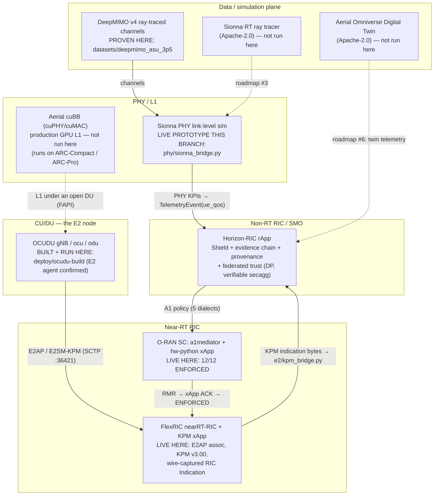

# Open 6G / AI-RAN ecosystem map — where Horizon-RIC fits

_Assessment date: 2026-07-27. Every repository pointer below was verified to
exist in this tree on that date; every external link returned content when
retrieved on that date (see [Sources](#7-sources)). The claim discipline matches
[SIXG_READINESS.md](SIXG_READINESS.md) and
[VENDOR_ONBOARDING.md](VENDOR_ONBOARDING.md): nothing is described as
integrated, run, or proven unless the artifact that proves it is named, and
"ecosystem / not run here" means exactly that._

## 1. Thesis

The open 6G / AI-RAN stack is layering up in public, under permissive
licences, for the first time: NVIDIA [open-sourced its Aerial RAN software
(cuBB/cuPHY L1, Aerial Framework, Omniverse Digital Twin) under Apache-2.0
in late 2025](https://blogs.nvidia.com/blog/open-source-aerial-ai-native-6g),
[Sionna](https://nvlabs.github.io/sionna/) provides Apache-2.0 link-level and
ray-tracing simulation, the Linux Foundation's OCUDU is a BSD-licensed
production CU/DU (srsRAN's successor), FlexRIC and the O-RAN Software
Community provide open near-RT RICs with E2, and the O-RAN SC Non-RT
RIC/SMO closes the loop at the top — with the AI-RAN Alliance and the OCUDU
Foundation supplying governance and data-pipeline blueprints around it.
Every one of those layers ships *capability*; none of them ships the layer a
regulator or an operator's risk office will ask for when an AI system starts
making RAN decisions: a decision safety gate with physics/regulatory
invariants ([`../src/horizon_ric/shield/`](../src/horizon_ric/shield/)), an
at-decision-time evidence chain with counterfactuals
([`../src/horizon_ric/evidence/`](../src/horizon_ric/evidence/)), model
provenance, and attack-aware federated aggregation with DP and verifiable
secure aggregation ([`../src/horizon_ric/federated/`](../src/horizon_ric/federated/)).
That trust/safety/evidence layer — deployed as a Non-RT RIC rApp that
terminates A1/O1/R1 — is Horizon's position in the stack, and this page maps
it against the rest, with what has actually been built and run here kept
strictly separate from what merely exists in the ecosystem.

## 2. The layered open stack

"Proven here" links the artifact produced in this repository. Upstream
compliance wording ("O-RAN compliant", "3GPP compliant") is the upstream
project's own claim, quoted, not verified by us — see [§6](#6-honest-boundaries).

| Layer | Open-source component(s) | Licence | Role for Horizon | Proven here? |
|---|---|---|---|---|
| **PHY / L1 (production, GPU)** | [NVIDIA Aerial CUDA-Accelerated RAN](https://github.com/NVIDIA/aerial-cuda-accelerated-ran) (cuPHY L1, cuMAC L2 scheduler, pyaerial ML bindings) + [Aerial Framework](https://github.com/NVIDIA/aerial-framework) (Python→CUDA pipeline toolchain) | Apache-2.0 ([open-sourced Oct 2025→](https://blogs.nvidia.com/blog/open-source-aerial-ai-native-6g)) | The declared production source of neural-PHY decisions the Shield validates — see the [`pyproject.toml`](../pyproject.toml) seam quoted in [§4](#the-declared-seam). | **Ecosystem / not run here** (needs NVIDIA GPUs). |
| **PHY simulation (link-level)** | [NVIDIA Sionna](https://github.com/NVlabs/sionna) — `sionna.phy` link-level simulator, `sionna.sys` system-level | Apache-2.0 | Stand-in for the production neural-PHY block: real coded MIMO-OFDM link simulation over real ray-traced channels → per-receiver PHY KPIs → `TelemetryEvent` → full pipeline. | **Live prototype in this branch**: [`../src/horizon_ric/phy/sionna_bridge.py`](../src/horizon_ric/phy/sionna_bridge.py) + [`../tests/test_sionna_phy_bridge.py`](../tests/test_sionna_phy_bridge.py); harness/proof under `deploy/sionna-phy/` (prototype in this branch). |
| **Radio propagation / channels** | [Sionna RT](https://nvlabs.github.io/sionna/) ray tracer (Mitsuba 3 based); [DeepMIMO v4](https://www.deepmimo.net/) ray-traced scenario datasets | Apache-2.0 (Sionna RT); DeepMIMO: no dataset licence file found in the scenario archive, so **not redistributed here** (see [datasheet](../datasets/deepmimo_asu_3p5/DATASHEET.md)) | Site-specific channels for evaluation instead of synthetic randoms. | **DeepMIMO proven here**: pinned, hash-verified build + benchmark ([`../datasets/deepmimo_asu_3p5/DATASHEET.md`](../datasets/deepmimo_asu_3p5/DATASHEET.md), [`../benchmarks/deepmimo_dsa_benchmark.py`](../benchmarks/deepmimo_dsa_benchmark.py)). Sionna RT itself: **not run here**. |
| **CU/DU (the E2 node)** | [OCUDU](https://github.com/ocudu/ocudu) (Linux Foundation; srsRAN Project successor). Ancestors/alternatives: [srsRAN](https://www.srslte.com/press_releases/srsran_becomes_ocudu/) (transitioned to OCUDU), [OpenAirInterface](https://openairinterface.org/) | BSD-3-Clause-Open-MPI (OCUDU); OAI Public License v1.1 (OAI) | The fully open E2 node under the near-RT RIC — the RAN whose telemetry Horizon consumes and whose behaviour A1 policies steer. | **Built and run here**: gNB/CU/DU binaries from the pinned submodule [`../third_party/ocudu`](../third_party/ocudu), E2 agent surface confirmed — [`../deploy/ocudu-build/OCUDU_BUILD_PROOF.md`](../deploy/ocudu-build/OCUDU_BUILD_PROOF.md). |
| **Near-RT RIC + E2 + xApps** | [FlexRIC](https://gitlab.eurecom.fr/mosaic5g/flexric) (Eurecom/Mosaic5G: nearRT-RIC, E2 agent, xApp SDK; E2AP v1/v2/v3, E2SM-KPM v2.01–v3.00); [O-RAN SC RIC platform](https://github.com/o-ran-sc/ric-plt-a1) (a1mediator, RMR, `hw-python` xApp) | OAI Public License v1.1 (Apache-2.0-based; [FlexRIC LICENSE](https://raw.githubusercontent.com/openaicellular/flexric/master/LICENSE)); Apache-2.0 software / CC-BY-4.0 docs ([O-RAN SC](https://raw.githubusercontent.com/o-ran-sc/ric-plt-a1/master/LICENSE.txt)) | The layer that owns E2. Horizon never terminates E2; it consumes the E2SM-KPM payloads this layer surfaces, via [`../src/horizon_ric/e2/kpm_bridge.py`](../src/horizon_ric/e2/kpm_bridge.py) ([module README](../src/horizon_ric/e2/README.md)). | **Live here, twice**: real FlexRIC E2AP association + E2SM-KPM v3.00 subscription + off-the-wire indication → Horizon decision → A1 `ENFORCED` ([`../deploy/e2-companion/E2_KPM_PROOF.md`](../deploy/e2-companion/E2_KPM_PROOF.md)); real O-RAN SC a1mediator + `hw-python` xApp, 12/12 `ENFORCED` ([`../deploy/XAPP_E2E_PROOF.md`](../deploy/XAPP_E2E_PROOF.md)). |
| **Non-RT RIC / SMO + rApps** | [O-RAN SC NONRTRIC](https://github.com/o-ran-sc/sim-a1-interface) (PMS, A1 simulator); **Horizon-RIC (this repository)** as the trust/safety rApp | Apache-2.0 (both) | Horizon's home layer: A1 policy emission (five dialects — [VENDOR_ONBOARDING.md](VENDOR_ONBOARDING.md)), O1/NETCONF, R1. | **Live here**: OSC A1 simulator CI-gated + full pipeline ([`../deploy/XAPP_E2E_PROOF.md`](../deploy/XAPP_E2E_PROOF.md)); NONRTRIC PMS recorded real-socket proof ([`../deploy/OSC_NONRTRIC_PROOF.md`](../deploy/OSC_NONRTRIC_PROOF.md)). |
| **Digital twin / system simulation** | [NVIDIA Aerial Omniverse Digital Twin (AODT)](https://github.com/NVIDIA/aerial-omniverse-digital-twin) — ray-traced channels applied to unabstracted PHY/MAC, city-scale ([docs](https://docs.nvidia.com/aerial/aerial-dt/text/ran_digital_twin.html)) | Apache-2.0 per the [open-sourcing announcement](https://blogs.nvidia.com/blog/open-source-aerial-ai-native-6g) (client tooling on GitHub; full release was scheduled March 2026) | Future high-fidelity telemetry/training source for the same `TelemetryEvent` bus. | **Ecosystem / not run here** (needs RTX-class GPUs + Omniverse). |
| **Compute tier (hardware)** | Not OSS: [NVIDIA ARC-Compact](https://developer.nvidia.com/blog/deploy-ai-ran-at-cell-sites-with-nvidia-arc-compact/) (Grace C1 + L4, cell-site) and [ARC-Pro](https://blogs.nvidia.com/blog/software-defined-ai-ran/) (RTX PRO 6000 Blackwell class); reference architectures published | n/a (hardware) | Where Aerial cuBB + an open DU would physically run; Horizon's own compute footprint is deliberately CPU-only (see [§4](#the-declared-seam)). | **Not run here.** Closest adjacent artifact: a Jetson Orin Nano-*envelope* constrained soak (emulated envelope, not ARC hardware — [`../deploy/ORIN_CONSTRAINED_SOAK_PROOF.md`](../deploy/ORIN_CONSTRAINED_SOAK_PROOF.md)). |
| **Governance / data initiatives** | [AI-RAN Alliance](https://ai-ran.org/press-releases/mwc-2026-momentum) (132 members, Feb 2026; [working groups + Data-for-AI](https://www.rcrwireless.com/20250227/network-infrastructure/ai-ran-alliance)); [OCUDU Ecosystem Foundation](https://www.linuxfoundation.org/press/linux-foundation-announces-ocudu-ecosystem-foundation-to-accelerate-open-source-ai-ran-innovation) | n/a (organisations, not code) | Data-for-AI is the closest published counterpart to Horizon's `TelemetryEvent` bus; alignment is roadmap work, not a fact ([SIXG_READINESS.md §5](SIXG_READINESS.md), item 6). | n/a — Horizon *targets* these bodies; it is not a member and claims no conformance ([§6](#6-honest-boundaries)). |

## 3. The end-to-end open stack, with Horizon in place

Solid arrows are paths that have carried real bytes in this repository's
proofs; dotted arrows are ecosystem paths that exist upstream but have not
been run here.



One deliberate asymmetry in this picture: the OC→FR edge is drawn solid
because both ends are real and running here. They are now **joined**: the
real OCUDU gNB completes an E2 Setup against the real FlexRIC near-RT RIC,
which registers it as an `ngran_gNB` and accepts its E2SM-KPM and E2SM-RC RAN
functions — [`../deploy/e2-companion/OCUDU_E2_JOIN_PROOF.md`](../deploy/e2-companion/OCUDU_E2_JOIN_PROOF.md).
The earlier association in
[`../deploy/e2-companion/E2_KPM_PROOF.md`](../deploy/e2-companion/E2_KPM_PROOF.md)
used FlexRIC's emulated E2 agent; that one uses the OCUDU binaries from
[`../deploy/ocudu-build/OCUDU_BUILD_PROOF.md`](../deploy/ocudu-build/OCUDU_BUILD_PROOF.md).
Two limits remain: only the CU-CP agent attaches (the DU-side agent does not
start), and there is no UE, so KPM indications would carry zeros.

## 4. What has actually been built and run this session

Proven, with the artifact that proves it:

- **OCUDU built from source, binaries run.** Three binaries (`gnb`, `ocu`,
  `odu`) from the pinned submodule commit `f46f5804…`, sha256-recorded,
  version banner captured, and the E2 agent surface (`--enable_du_e2`,
  SCTP :36421, E2SM-KPM/RC/CCC linked in) confirmed from the binaries' own
  `--help` output — [`../deploy/ocudu-build/OCUDU_BUILD_PROOF.md`](../deploy/ocudu-build/OCUDU_BUILD_PROOF.md).
  No RF, no UE attach, no live E2 association claimed there.
- **FlexRIC near-RT RIC live, E2SM-KPM → Horizon → A1 closed.** Real E2AP
  setup, real KPM v3.00 Style-4 subscription, RIC Indications captured off
  the wire, decoded by [`../src/horizon_ric/e2/kpm_bridge.py`](../src/horizon_ric/e2/kpm_bridge.py)
  against the sha256-pinned spec text, driven through planner → Shield →
  A1 → real a1mediator → real `hw-python` xApp → `enforceStatus=ENFORCED`,
  decision-to-accept latency 7.31 ms — with one disclosed substitution (the
  sandbox kernel has no SCTP; an LD_PRELOAD UDP shim carried FlexRIC's
  unmodified bytes) — [`../deploy/e2-companion/E2_KPM_PROOF.md`](../deploy/e2-companion/E2_KPM_PROOF.md).
- **O-RAN SC A1 + official xApp, 12/12 ENFORCED.** The full pipeline against
  the real Go a1mediator + RMR + `hw-python`, 12/12 policies accepted and
  ACKed, three-witness proof — [`../deploy/XAPP_E2E_PROOF.md`](../deploy/XAPP_E2E_PROOF.md)
  (per-dialect validation levels in [VENDOR_ONBOARDING.md](VENDOR_ONBOARDING.md)).
- **Sionna → Horizon PHY telemetry seam — run end to end this session.**
  [`../src/horizon_ric/phy/sionna_bridge.py`](../src/horizon_ric/phy/sionna_bridge.py)
  turns per-receiver link-level KPIs (post-equalisation SINR, coded BLER,
  throughput, spectral efficiency) from a real Sionna coded MIMO link-level
  simulation over real DeepMIMO ray-traced channels into `TelemetryEvent(ue_qos)`
  records for the standard pipeline; Sionna is imported lazily so the core
  package stays accelerator-free. Full run + methodology:
  [`../deploy/sionna-phy/SIONNA_PHY_PROOF.md`](../deploy/sionna-phy/SIONNA_PHY_PROOF.md).
  Measured (CPU-only, 12 real ASU 3.5 GHz receiver sites, 1×4 single-layer):
  the coded BLER follows the correct 5G-NR LDPC 16-QAM rate-½ waterfall (0 down
  to ~9 dB post-eq SINR, 0.79 at 7 dB, 1.0 by −4 dB), so the pipeline's risk
  rises monotonically with falling SINR (0.00 → 0.34 → 0.80 → 1.00) and the
  planner grades the 12 sites into **6 `qos.priority`, 1 `traffic.steering`,
  5 `admission.control`** — all **12/12 accepted and `ENFORCED`** by the real
  O-RAN-SC a1mediator + hw-python xApp, hash-chained audit intact.

Ecosystem-available but **not run here**, stated once and plainly: Aerial
cuBB/cuPHY (needs NVIDIA GPUs), ARC-Compact/ARC-Pro (hardware we do not
have), AODT (RTX + Omniverse), Sionna RT ray tracing (code available, not
exercised — the prototype uses DeepMIMO channels), and OpenAirInterface as
an alternative E2 node.

<a id="the-declared-seam"></a>The Aerial seam is not an afterthought bolted
on for this page — it is declared in the package metadata itself
([`../pyproject.toml`](../pyproject.toml), the comment above `dependencies`):

```toml
# Deliberately torch-free. The Shield validates the *decisions* a neural-PHY
# block emits (in production, from NVIDIA Aerial cuBB / O-RAN E2 KPM); it never
# runs a neural network itself. Everything here installs on a stock Python 3.10+
# with no CUDA / no accelerator.
```

That is the division of labour in one comment: the GPU stack (Aerial in
production, Sionna in simulation) *produces* neural-PHY behaviour; Horizon
*judges* it — envelope invariants over independently measured TBLER,
constellation legality, lineage records
([`../src/horizon_ric/shield/invariants.py`](../src/horizon_ric/shield/invariants.py),
[`../src/horizon_ric/phy/neural_rx.py`](../src/horizon_ric/phy/neural_rx.py),
[`../src/horizon_ric/phy/jamming.py`](../src/horizon_ric/phy/jamming.py)) —
without ever needing the accelerator itself.

## 5. Integration roadmap

Effort scale as in [SIXG_READINESS.md §5](SIXG_READINESS.md): S ≈ days,
M ≈ 1–3 weeks, L ≈ 4+ weeks. This table extends (does not replace) the 6G
roadmap there; items 5–7 of that table remain in force.

| # | Priority | Integration | Effort | Blocked on |
|---|---|---|---|---|
| 1 | **P1** | **Finish the Sionna link-level → Horizon path**: complete the `deploy/sionna-phy/` harness + proof doc around [`../src/horizon_ric/phy/sionna_bridge.py`](../src/horizon_ric/phy/sionna_bridge.py), CI-gate the pure-Python half, publish headline KPIs. | S | Nothing hard — CPU-runnable (Sionna runs on CPU, slower); the only cost is the sionna/framework install weight, kept out of core deps. |
| 2 | **P1** | ~~**OCUDU gNB as the live E2 node behind FlexRIC**~~ — **done for E2 Setup** ([proof](../deploy/e2-companion/OCUDU_E2_JOIN_PROOF.md)): the real gNB registers as an `ngran_gNB` with E2SM-KPM and E2SM-RC accepted. The UDP shim was extended for OCUDU's one-to-one client calls (`sctp_bindx`/`sctp_connectx`/`sctp_getpaddrs` and, decisively, `getsockopt(IPPROTO_SCTP)`). **Remaining**: the DU-side E2 agent does not start despite `enable_du_e2`, and there is no UE, so the capture→bridge→A1 loop still runs on FlexRIC's emulated agent. | M | A UE-side traffic source (ZMQ RF + a UE stack) for non-zero KPMs; an SCTP-capable kernel for conformant transport. |
| 3 | **P2** | **Sionna RT channel generation** alongside DeepMIMO: same `PhyMeasurement` path, but channels ray-traced in-repo (differentiable, scene-controllable) instead of downloaded — mirroring the pinning/hash discipline of the [DeepMIMO datasheet](../datasets/deepmimo_asu_3p5/DATASHEET.md). | S–M | Nothing — CPU-runnable. |
| 4 | **P2** | **Aerial cuBB / pyaerial neural-RX decisions → Shield**: exercise the declared production seam — run a pyaerial channel-estimation/neural-RX block, feed its decisions and independently measured TBLER through `NeuralRxEnvelopeInvariant` and the AI-PHY lineage records. | M | **NVIDIA GPU** (none in this environment; ARC-Compact-class L4 is the documented minimum shape for cuBB L1 work). |
| 5 | **P3** | **AI-RAN Alliance Data-for-AI mapping**: `TelemetryEvent`/`FeatureFrame` onto the Alliance's data-collection blueprints (carried from [SIXG_READINESS.md §5](SIXG_READINESS.md) item 6). | S–M | Blueprint publication cadence; membership question is open ([§6](#6-honest-boundaries)). |
| 6 | **P3** | **AODT digital-twin telemetry → Horizon**: consume AODT's PHY/MAC-faithful, city-scale simulation output as a telemetry modality for training and for stress-testing Shield invariants against site-specific scenarios. | L | RTX-class GPUs + an Omniverse deployment; AODT's full open release cadence (client tooling is on GitHub; the complete twin was scheduled for March 2026 per NVIDIA). |

## 6. Honest boundaries

- **No 6G specification exists (2026-07-27), so no 6G compliance is claimed —
  by us or anyone.** The full argument, with the 3GPP Release 20/21 calendar,
  is [SIXG_READINESS.md §1](SIXG_READINESS.md). Everything on this page is
  5G-generation open source positioned for 6G work.
- **Horizon terminates A1/O1/R1, not E2 — and will not grow an E2
  termination.** The E2 leg belongs to the near-RT RIC;
  [`../src/horizon_ric/e2/`](../src/horizon_ric/e2/README.md) owns no
  transport and decodes payloads the RIC surfaces. Both proof docs restate
  this ([OCUDU](../deploy/ocudu-build/OCUDU_BUILD_PROOF.md),
  [E2 KPM](../deploy/e2-companion/E2_KPM_PROOF.md)).
- **Using or bridging to these projects is not endorsement, partnership,
  membership, or conformance.** Horizon consumes NVIDIA Aerial/Sionna,
  OCUDU, FlexRIC and O-RAN SC code under their open-source licences; no
  relationship with NVIDIA, the Linux Foundation, Eurecom, the O-RAN
  Alliance or the AI-RAN Alliance is implied. Upstream claims of "O-RAN
  compliant" or "3GPP compliant" are quoted from upstream and were not
  independently verified here. Horizon holds no O-RAN Alliance
  certification and is not an AI-RAN Alliance member — the alliance is a
  stated target, nothing more.
- **The strongest proofs on this page carry disclosed caveats** — the SCTP→UDP
  shim in the FlexRIC run, synthetic per-UE data from the emulated agent,
  the not-yet-joined OCUDU↔FlexRIC edge (§3), and the fact that no vendor
  RAN has ever been in the loop
  ([VENDOR_ONBOARDING.md](VENDOR_ONBOARDING.md): eiap/mantaray are
  wire-contract only). Read the proof docs, not just this summary.
- **DeepMIMO data is not redistributed** (no dataset licence file was found
  in the scenario archive); only hashes and aggregate results are committed
  ([datasheet](../datasets/deepmimo_asu_3p5/DATASHEET.md)).
- **No NVIDIA hardware claims.** ARC-Compact/ARC-Pro are described from
  NVIDIA's published material only; the closest thing this repo has run is
  an emulated Jetson Orin Nano envelope soak with one acceptance bar failed
  and disclosed ([`../deploy/ORIN_CONSTRAINED_SOAK_PROOF.md`](../deploy/ORIN_CONSTRAINED_SOAK_PROOF.md)).

## 7. Sources

All external links retrieved 2026-07-27; repository pointers verified against
this tree the same day. OCUDU/3GPP/ITU sources are in
[SIXG_READINESS.md §6](SIXG_READINESS.md) and are not repeated where already
cited above.

**NVIDIA Aerial (open-sourced software)**

- NVIDIA blog, [NVIDIA Open Sources Aerial Software to Accelerate AI-Native 6G](https://blogs.nvidia.com/blog/open-source-aerial-ai-native-6g) (28 Oct 2025) — Aerial CUDA-Accelerated RAN, AODT and Aerial Framework to GitHub under Apache-2.0 from December 2025 (AODT full release March 2026); Sionna past 200k downloads / 500 citations.
- [github.com/NVIDIA/aerial-cuda-accelerated-ran](https://github.com/NVIDIA/aerial-cuda-accelerated-ran) — "An SDK … for building commercial-grade, AI-native, 3GPP, and O-RAN compliant 5G/6G gNB software on NVIDIA-accelerated computing platforms"; Apache-2.0; cuPHY / cuMAC / pyaerial.
- [github.com/NVIDIA/aerial-framework](https://github.com/NVIDIA/aerial-framework) — Python→GPU pipeline toolchain + real-time runtime for Aerial RAN Computer platforms.
- [github.com/NVIDIA/aerial-omniverse-digital-twin](https://github.com/NVIDIA/aerial-omniverse-digital-twin) — AODT client/viewer/worker; [AODT RAN Digital Twin docs](https://docs.nvidia.com/aerial/aerial-dt/text/ran_digital_twin.html) — unabstracted PHY/MAC with ray-traced channels; [AODT technical blog](https://developer.nvidia.com/blog/improve-ai-native-6g-design-with-the-nvidia-aerial-omniverse-digital-twin/).
- [NVIDIA AI Aerial developer page](https://developer.nvidia.com/industries/telecommunications/ai-aerial) — the suite map (platforms, software, hardware tiers incl. Jetson Orin / DGX Spark for research).

**NVIDIA ARC (compute tier, not OSS)**

- [Deploy AI-RAN at Cell Sites with NVIDIA ARC-Compact](https://developer.nvidia.com/blog/deploy-ai-ran-at-cell-sites-with-nvidia-arc-compact/) (18 May 2025) — Grace C1 (72-core) + L4 GPU, cell-site power envelope, runs cuPHY/cuMAC.
- [NVIDIA and Partners Show That Software-Defined AI-RAN Is the Next Wireless Generation](https://blogs.nvidia.com/blog/software-defined-ai-ran/) (28 Feb 2026) — ARC-Pro with RTX PRO 6000 Blackwell Server Edition; NVIDIA joining the OCUDU Ecosystem Foundation; partner COTS AI-RAN systems.

**NVIDIA Sionna**

- [Sionna documentation](https://nvlabs.github.io/sionna/) (v2.0.1) — Sionna PHY (link-level), Sionna RT (ray tracer on Mitsuba 3), Sionna SYS (system-level), Sionna Research Kit on DGX Spark; runs on CPU and GPU.
- [github.com/NVlabs/sionna](https://github.com/NVlabs/sionna) — Apache-2.0; [developer.nvidia.com/sionna](https://developer.nvidia.com/sionna) — positioning for 6G/ML research.

**Near-RT RIC / RAN stacks**

- [FlexRIC (gitlab.eurecom.fr/mosaic5g/flexric)](https://gitlab.eurecom.fr/mosaic5g/flexric) — Eurecom/Mosaic5G nearRT-RIC + E2 agent + xApp SDK; E2AP v1.01/v2.03/v3.01, E2SM-KPM v2.01/v2.03/v3.00 (README); licence per the repo [LICENSE (OAI Public License v1.1)](https://raw.githubusercontent.com/openaicellular/flexric/master/LICENSE); exact build pins used here are in [`../deploy/e2-companion/E2_KPM_PROOF.md`](../deploy/e2-companion/E2_KPM_PROOF.md).
- O-RAN SC: [ric-plt/a1 (a1mediator)](https://github.com/o-ran-sc/ric-plt-a1), [sim-a1-interface](https://github.com/o-ran-sc/sim-a1-interface); licence per [LICENSE.txt](https://raw.githubusercontent.com/o-ran-sc/ric-plt-a1/master/LICENSE.txt) — Apache-2.0 (software) / CC-BY-4.0 (docs).
- OCUDU / srsRAN lineage: [LF announcement](https://www.linuxfoundation.org/press/linux-foundation-announces-ocudu-ecosystem-foundation-to-accelerate-open-source-ai-ran-innovation), [github.com/ocudu/ocudu](https://github.com/ocudu/ocudu), [srsRAN → OCUDU transition](https://www.srslte.com/press_releases/srsran_becomes_ocudu/) — clone-verified detail in [SIXG_READINESS.md §4](SIXG_READINESS.md).
- OpenAirInterface: [openairinterface.org](https://openairinterface.org/); [Driving Innovation in 6G Wireless Technologies: The OpenAirInterface Approach (arXiv:2412.13295)](https://arxiv.org/pdf/2412.13295).

**Governance / data**

- AI-RAN Alliance: [MWC 2026 momentum release](https://ai-ran.org/press-releases/mwc-2026-momentum) (132 members); [RCR Wireless — working groups + Data-for-AI](https://www.rcrwireless.com/20250227/network-infrastructure/ai-ran-alliance).

**Datasets**

- [DeepMIMO](https://www.deepmimo.net/) — ray-tracing-based MIMO channel dataset framework (v4); repo usage pinned in [`../datasets/deepmimo_asu_3p5/DATASHEET.md`](../datasets/deepmimo_asu_3p5/DATASHEET.md).
