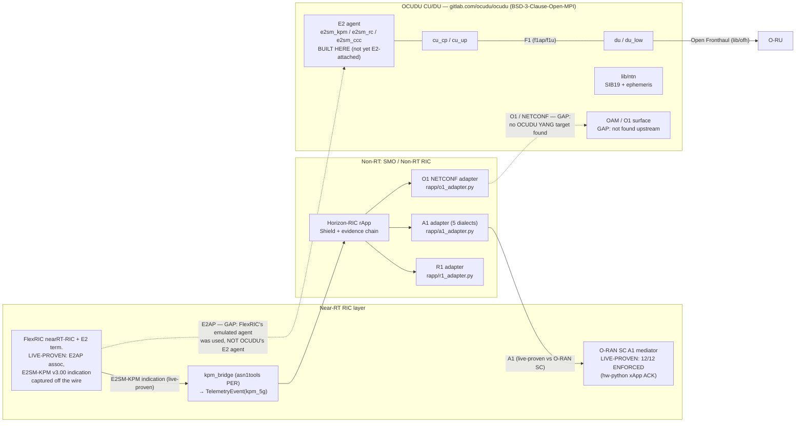

# 6G readiness — an honest assessment (no compliance claims)

_**Re-verified 2026-07-28** against live primary sources (3gpp.org, itu.int,
o-ran.org, the OCUDU repository), replacing a 2026-07-27 revision that had
drifted from a knowledge snapshot. Every time-sensitive statement below carries
a citation and an "as of" date. Every repository pointer was checked to exist in
this tree on 2026-07-28 by `ls`/`grep`. The claim discipline matches the rest of
the repo: nothing is described as validated unless the validating artifact is
named. Section 6 lists the sources **and states plainly what this verification
could not reach.**_

**Read first:** [§1.5 — what the previous revision got wrong](#15-corrections-to-the-2026-07-27-revision).

---

## 1. Status: no normative 6G specification exists — but 6G Technical Reports now do

### 1.1 The bottom line

**As of 2026-07-28 there is no normative 6G specification, from 3GPP or anyone
else. No 6G compliance claim is possible — not for this project, not for any
vendor. That is unchanged.**

What *has* changed, and what this document now says that the previous revision
did not: **3GPP has approved and published its first 6G Technical Reports.**
Two exist today and were verified present in the 3GPP specification archive on
2026-07-28:

| Document | Title (3GPP DynaReport) | Published version seen in archive |
|---|---|---|
| **TR 22.870** | "Study on 6G Use Cases and Service Requirements" (SA1, Rel-20) | `22870-k00.zip` |
| **TR 38.914** | "Study on 6G Scenarios and requirements" (TSG RAN) | `38914-k00.zip` |

TR 38.914 was approved at TSGs#112 on 14 June 2026 (v1.0.0 in RP‑261565) — 3GPP
calls it ["the first study … to identify typical usage scenarios for 6G radio
technology"](https://www.3gpp.org/news-events/3gpp-news/6g-38914) and notes it
"can now be shared with ITU-R as a contribution to the IMT-2030 process".
TR 22.870 is described by 3GPP as ["the Stage 1 anchor for Rel‑21 normative
work"](https://www.3gpp.org/specifications-technologies/releases/release-21).

The distinction that matters and must not be blurred: **a TR is a study report,
not a specification.** A TR imposes no conformance obligation and defines no
testable interface. 3GPP itself states the split explicitly on the Release 20
page: *"3GPP has concluded that two 3GPP Releases are needed to specify 6G:
Release 20 for Studies, Release 21 for the normative work."*
([3gpp.org, Release 20](https://www.3gpp.org/specifications-technologies/releases/release-20),
retrieved 2026-07-28.)

So: **6G documents now exist and can be read and aligned to. 6G *specifications*
do not exist and cannot be complied with.** The earliest date at which any
normative 6G text can be frozen is **March 2027** (Rel-21 Stage-1), and the
earliest date at which a 6G protocol is implementable-to-freeze is **December
2028** (Rel-21 Stage-3). Both dates are 3GPP-approved, cited in §1.2.

Also unchanged, and worth saying once: **no vendor offers 6G compatibility
today**, because there is nothing to be compatible with. Horizon's vendor
surface is the five-dialect A1 matrix in
[`VENDOR_ONBOARDING.md`](VENDOR_ONBOARDING.md), with per-dialect validation
levels stated honestly (live OSC simulator / real-socket wire-contract /
offline mock-contract).

### 1.2 3GPP: release status, from the 3GPP portal

The table below is transcribed from the release-timeline table on
[3gpp.org/specifications-technologies/releases](https://www.3gpp.org/specifications-technologies/releases)
(the page states the data is extracted from the 3GPP Portal), retrieved
2026-07-28:

| Release | Status *(3GPP portal wording)* | Functional freeze (Stage 3 complete) | End date (protocols stable) |
|---|---|---|---|
| Release 20 | **Open** | 2027-03 (projected, SA#115) | 2027-06 (projected, SA#116) |
| Release 19 | **Open** | 2025-09 (SA#109) | 2025-12-12 (SA#110) |
| Release 18 | **Frozen** | 2024-03 (SA#103) | 2024-06 (SA#104) |
| Release 17 | **Frozen** | 2022-03-18 (SA#95) | 2022-06-10 (SA#96) |

Three consequences, stated precisely because the previous revision was loose here:

- **The most recent release the 3GPP portal marks `Frozen` is Release 18, not
  Release 19.** Rel-19 reached its functional freeze in September 2025 and its
  protocol-stable end date on 2025-12-12, and 3GPP's own commentary says
  ["Rel-19 was completed in December 2025, at TSGs#110"](https://www.3gpp.org/news-events/3gpp-news/rel-20-webinar).
  The portal nonetheless still carries Rel-19 as `Open` — a frozen release
  continues to accept corrections. Both statements are true; only the second is
  the portal's.
- **Release 20 is not "the 6G study release".** 3GPP describes it as *"the final
  '5G‑Advanced only' release"* and reports **126 Work Items and 74 Study Items
  for 5G-Advanced** underway across RAN, SA and CT, per the Work Plan presented
  at TSGs#111 in March 2026 (SP-260360). Rel-20 carries a great deal of
  *normative* work; what it does not carry is normative **6G** work. Rel-20
  5G-Advanced stage plan, from the same page and the
  [ATIS Rel-20 webinar report](https://www.3gpp.org/news-events/3gpp-news/rel-20-webinar):
  Stage-1 frozen June 2025 (TSGs#108); Stage-2 completion September 2026
  (TSGs#113); Stage-3 functional freeze March 2027 (TSGs#115); ASN.1/OpenAPI
  freeze June 2027.
- **Release 21 is the first normative 6G release, and its timeline is now
  approved** — agreed at TSGs#112, Singapore, 10 June 2026 in
  RP‑260868 / SP‑260595 / CP‑261259. Verbatim from
  [3gpp.org, "Timeline for Release 21"](https://www.3gpp.org/news-events/3gpp-news/rel21-timeline):

  | Rel-21 milestone (5G-Adv. and 6G) | Date |
  |---|---|
  | 5G-Adv./6G Package Approval **& Stage-1 freeze** | **Mar. 2027** |
  | **Stage-2 freeze** (80% completion checkpoint Mar 2028) | **Jun. 2028** |
  | **Stage-3 freeze** | **Dec. 2028** (TSGs#122) |
  | **ASN.1/OpenAPI freeze** | **Mar. 2029** |

**Rel-20 6G study items.** 3GPP lists fourteen; 3GPP's TSGs#112 report confirms
["14 Study Items for 6G progressing"](https://www.3gpp.org/news-events/3gpp-news/tsg112).
The full table is on the [Release 20 page](https://www.3gpp.org/specifications-technologies/releases/release-20);
these are the ones whose subject matter touches this repository, and naming them
is the point — the previous revision dismissed all of Rel-20 as "nothing to
implement", which is the wrong posture toward a study you could contribute to:

| SID | Title | Acronym | Group | Why it matters here |
|---|---|---|---|---|
| 1090044 | Study on Security for the 6G System | `FS_6G_SEC` | SA3 | The 6G security architecture Horizon's Shield/evidence layer would have to sit under. |
| 1100014 | Study on 6G Management and Orchestration | `FS_6G_OAM` | SA5 | The successor context for TS 28.105 / 28.552 / 28.554, i.e. where a non-RT assurance layer is specified. |
| 1100011 | Study on Lawful Interception for 6G | `FS_6G_LI` | SA3LI | Successor to the TS 33.127 anchor behind [`policy/li_constraint.py`](../src/horizon_ric/policy/li_constraint.py). |
| 1080057 | Study on Architecture for 6G System | `FS_6G_ARC` | SA2 | Determines whether a non-RT control point of Horizon's shape exists at all in 6G. |
| 1080072 | Study on 6G Radio | `FS_6G_Radio` | RAN1 | The eventual normative anchor for the Shield's RF invariants. |
| 1080045 | Study on Transitioning to Post Quantum Cryptography in 3GPP | `FS_CryptoPQC` | SA3 | Direct migration pressure on [`provenance/signing.py`](../src/horizon_ric/provenance/signing.py) and the evidence hash chain. |

`FS_6G_Radio` will report as **TR 38.960** — for information at TSG#115, for
approval at TSG#116 (source: RP‑253876, tabulated on the
[3GPP TR 38.914 approval announcement](https://www.3gpp.org/news-events/3gpp-news/6g-38914)).
**We checked the 3GPP archive on 2026-07-28: no TR 38.960 has been published
yet.** It is a future document; do not cite it as if it exists.

**Terminology.** At the TSGs#112 joint CT/RAN/SA session (Singapore, 9 June
2026) 3GPP agreed a basic term set: **6GR** (6G Radio), **6G RAT**, **6G RAN**,
**6GC / 6G CN**, **6GS** (6G System)
([source](https://www.3gpp.org/news-events/3gpp-news/6g-38914)). This document
uses them.

**Design posture.** 3GPP's PCG endorsed a decision *"to create lean and
streamlined standards for 6G, e.g., by dimensioning an appropriate set of
functionalities, minimizing the adoption of multiple options for the same
functionality, avoiding excessive configurations"*
([ATIS Rel-20 webinar report](https://www.3gpp.org/news-events/3gpp-news/rel-20-webinar)).
A "lean 6G" is a reason to expect *fewer* extension points for third-party
assurance layers, not more. That cuts against this project and is recorded as
such.

**Early technical directions (secondary source — flagged).** 3GPP's own pages do
not publish the RAN#112 physical-layer outcomes. Ericsson's
[6G standardization milestones and RAN decisions](https://www.ericsson.com/en/blog/2026/6/6g-standardization-key-milestones-and-ran-decisions)
(12 June 2026) reports: CP-OFDM in the downlink; CP-OFDM **and** DFT-s-OFDM in
the uplink; uniform QAM as the modulation basis; 5G channel codes "largely
reused"; bandwidths from a minimum of 3 MHz in specific spectrum up to 400 MHz;
both single-unit and CU/DU-split base-station design options approved; dynamic
carrier sharing between 5G and 6G as the migration baseline. Open for the
September 2026 plenary (TSGs#113, Madrid): DU/CU functional-split detail,
spectrum-sharing overhead, carrier-aggregation feasibility for 5G→6G migration,
and mmWave/FR1 aggregation. **This is a vendor blog, not 3GPP. Treat it as
indicative, not as specification text.** It is repeated here only because the
CU/DU-split and bandwidth points bear directly on §4.4 and on the Shield's
occupied-bandwidth invariant.

### 1.3 ITU-R IMT-2030

The previous revision described only Recommendation ITU-R M.2160, the November
2023 *framework*. That is materially out of date: **ITU-R now has draft
quantitative requirements and draft evaluation guidelines.** From the
[ITU-R WP 5D IMT-2030 page](https://www.itu.int/en/ITU-R/study-groups/rsg5/rwp5d/imt-2030/Pages/default.aspx),
retrieved 2026-07-28:

- **February 2026** — WP 5D completed the draft new Report *"Minimum
  requirements related to technical performance for IMT-2030 radio
  interface(s)"*. It **"defines 20 minimum technical performance requirements"**
  and provides "a consistent basis for specification and evaluation". Submitted
  to ITU-R Study Group 5 for approval in **12/2026** (document 5/116). ITU's own
  news item adds that ["seven of them are new and specific to describe the 6G
  performances"](https://www.itu.int/hub/2026/03/imt-2030-technical-requirements-for-the-6g-future/).
- **June 2026** — WP 5D completed the draft new Report *"Guidelines for
  evaluation of radio interface technologies for IMT-2030"*. It defines three
  evaluation methods (simulation, analytical, inspection) and **"seven test
  environments mapped to the IMT-2030 usage scenarios, including three newly
  introduced environments (Indoor Factory-HRLLC, Indoor Factory-ISAC, and Urban
  Macro-ISAC)"**, and **"introduces extended channel models, including
  near-field, spatial non-stationarity, and ISAC-specific models"**. Submitted
  to SG 5 for approval in December 2026 (document 5/119).
- **Still outstanding** — WP 5D "is expected to conclude its work on the draft
  new Reports ITU-R M.[IMT-2030.EVAL] and ITU-R M.[IMT-2030.SUBMISSION] at its
  next meeting(s)".
- **Submission window confirmed unchanged** — the Circular Letter agreed at WP 5D
  #47 (10/2024), published as **5/LCCE/115**, "invites submissions of proposals
  for RIT-candidates for IMT-2030 to be received by ITU in the timeframe
  **02/2027-02/2029**".
- **M.2160** itself remains what it was: a framework (six usage scenarios, four
  overarching design principles, capability dimensions), approved November 2023.
  It is not a radio interface specification and never was.

The three new ISAC/HRLLC test environments and the ISAC-specific channel models
are the most concrete external hook this project has acquired since the last
revision — see the ISAC gap in §2 and roadmap item 5 in §5.

### 1.4 What "6G-ready" can honestly mean for this repository

1. **Alignment with published direction artifacts** — the M.2160 usage scenarios
   (§2) and the named Rel-19/Rel-20 features 3GPP itself treats as the on-ramp
   (§3), mapped to code that exists in this tree, with "not present" stated
   where it is true.
2. **Forward-compatible interfaces** — the I/O contract
   ([`../src/horizon_ric/io/schemas.py`](../src/horizon_ric/io/schemas.py)) is an
   additive modality registry with `extra="allow"` round-tripping, so new 6G
   telemetry types are new literals + submodels rather than schema breaks; and
   the Shield invariants are physics/regulatory properties (occupied bandwidth,
   EIRP, PFD) that survive a generation change — though their normative anchors
   (e.g. 3GPP TS 38.104 §6.6, cited in
   [`../src/horizon_ric/shield/invariants.py`](../src/horizon_ric/shield/invariants.py))
   will need re-pointing at the 6GR RF specification when one exists, i.e. no
   earlier than the Rel-21 Stage-3 freeze in December 2028.
3. **Live-proven integration with the open-source substrate on which open 6G is
   being built** — a real O-RAN SC a1mediator + `hw-python` xApp run with 12/12
   policies `ENFORCED`
   ([`../deploy/XAPP_E2E_PROOF.md`](../deploy/XAPP_E2E_PROOF.md)), and a real
   FlexRIC E2AP association carrying an E2SM-KPM v3.00 indication decoded off the
   wire into a Horizon decision
   ([`../deploy/e2-companion/E2_KPM_PROOF.md`](../deploy/e2-companion/E2_KPM_PROOF.md)).
   §4 covers the O-RAN ALLIANCE specification surface and the OCUDU CU/DU path.

What it cannot mean: conformance, compliance, certification, or "6G-compatible".

### 1.5 Corrections to the 2026-07-27 revision

Recorded openly, because the value of this document is that it does not quietly
paper over its own errors.

| # | Previous claim | Status on 2026-07-28 | Correction |
|---|---|---|---|
| 1 | "Release 19 … was frozen at the December 2025 meetings" and is "the last frozen release" | **Imprecise** | Rel-19's *functional* freeze was 2025-09 (SA#109); 2025-12-12 (SA#110) is its protocol-stable end date. The 3GPP portal's most recent `Frozen` release is **Rel-18**. |
| 2 | "Release 20 is the 6G *study* release — technical reports only, no normative 6G specifications" | **Half wrong** | Correct that Rel-20 has no normative *6G* work. Wrong that Rel-20 is TR-only: 3GPP calls it "the final '5G‑Advanced only' release", with 126 WIs and 74 SIs of 5G-Advanced work. |
| 3 | Rel-21: "first functional freeze March 2027, checkpoint March 2028, second functional freeze June 2028, Stage-3 final freeze December 2028, code freeze March 2029" | **Mislabelled** | 3GPP's own labels: Package Approval & **Stage-1** freeze Mar 2027; **Stage-2** freeze Jun 2028 (80% checkpoint Mar 2028); **Stage-3** freeze Dec 2028; **ASN.1/OpenAPI** freeze Mar 2029. Dates were close; the stage names were wrong. |
| 4 | Rel-21 timeline sourced from a third-party blog | **Superseded** | Now sourced from [3gpp.org](https://www.3gpp.org/news-events/3gpp-news/rel21-timeline) with the agreement numbers RP‑260868 / SP‑260595 / CP‑261259. |
| 5 | Rel-20: "Nothing to implement: Rel-20 produces TRs only. Watch item." | **Wrong posture** | Rel-20 has 14 named 6G study items, six of which (SA3 security, SA5 6G OAM, SA3LI 6G LI, SA2 architecture, RAN1 6G Radio, SA3 PQC) bear directly on this project. Tabulated in §1.2. |
| 6 | ITU-R described as framework-only (M.2160), no requirements work cited | **Materially stale** | 20 minimum technical performance requirements completed Feb 2026; evaluation guidelines completed Jun 2026 with three new ISAC/HRLLC test environments and ISAC-specific channel models. §1.3. |
| 7 | "no 6G specification exists … and neither can anyone else [claim compliance]" | **True, but incomplete** | Still true for *specifications*. But two 6G **TRs** (22.870, 38.914) are now published and were verified in the 3GPP archive. §1.1 restates the distinction. |
| 8 | CP-OFDM / channel-code / bandwidth decisions asserted flatly | **Unattributed** | Not published on 3gpp.org. Now attributed to an Ericsson blog and explicitly labelled secondary. §1.2. |
| 9 | O-RAN ALLIANCE specification state: essentially absent from the document | **Gap** | New §4.1 covers the 17 July 2026 release train, including the R1/A1 conflict-management work that is the closest published counterpart to the Shield. |
| 10 | OCUDU "last commit dated 2026-07-22" | **Ambiguous** | That is the *committer* date of `9b0cfa60…`; its *author* date is 2026-07-13. Re-verified 2026-07-28 — see §4.3. |
| 11 | Roadmap items 1 & 2 ("OCUDU as the live E2 node", "companion E2SM-KPM xApp") listed as unstarted | **Stale within this repo** | Both have since been substantially delivered — OCUDU built from source, and a real E2SM-KPM → Horizon → A1 `ENFORCED` chain over FlexRIC. §5 restates what is and is not done. |
| 12 | §1 claimed the live proof had "no E2 node behind it" | **Superseded** | True of the A1-only proof; no longer true of the repo as a whole. §4.4. |

---

## 2. IMT-2030 usage scenarios × Horizon-RIC capabilities

The six M.2160 usage scenarios and four overarching design principles (as
restated on the [ITU-R IMT-2030 page](https://www.itu.int/en/ITU-R/study-groups/rsg5/rwp5d/imt-2030/Pages/default.aspx),
retrieved 2026-07-28), against what actually exists in this tree. "Not present"
means not present.

| M.2160 usage scenario | Horizon-RIC today | Evidence in tree | Honest gap |
|---|---|---|---|
| **Immersive Communication (IC)** | Weak/indirect. Per-UE QoS telemetry (latency, throughput, BLER) and SLA-risk prediction are QoS-generic, not XR-specific. | `ue_qos` modality in [`io/schemas.py`](../src/horizon_ric/io/schemas.py); `sla_risk_*` fields of `PredictedOutcome` in [`evidence/schema.py`](../src/horizon_ric/evidence/schema.py) | No XR/immersive-specific model, KPI, or policy type. |
| **Hyper Reliable & Low-Latency Communication (HRLLC)** | Not present as a real-time capability. Horizon is a **non-RT rApp**; its risk horizons are 30 s / 1 min / 5 min. Its reliability contribution is indirect: fail-closed fallback of a neural receiver to the certified classical baseline. | `NeuralRxEnvelopeInvariant` in [`shield/invariants.py`](../src/horizon_ric/shield/invariants.py) | No sub-10 ms control path exists or is claimed; HRLLC-grade control belongs to the near-RT RIC / DU, not this rApp. ITU-R has now defined an **Indoor Factory-HRLLC** evaluation test environment; nothing here targets it. |
| **Massive Communication (MC)** | Not present. Closest artifact is the multi-user DSA environment (n secondary users contending for channels), which is spectrum contention, not mMTC scale. | [`spectrum/dsa_env.py`](../src/horizon_ric/spectrum/dsa_env.py) | No mMTC/RedCap/Ambient-IoT-class features. |
| **Ubiquitous Connectivity (UC)** | **Strong — this is a design centre.** NTN telemetry modalities, ephemeris ingestion, weather-driven propagation inputs, NTN capacity accounting, and a hard ITU-R-style PFD ceiling on LEO downlink power. | `kpm_ntn`, `tle`, `ephemeris_oem`, `weather_grib` modalities in [`io/schemas.py`](../src/horizon_ric/io/schemas.py); `PfdCeilingInvariant` + NTN slant-range sanity in [`shield/invariants.py`](../src/horizon_ric/shield/invariants.py); `ntn_capacity_used` / `ntn_capacity_exhausted` in [`evidence/schema.py`](../src/horizon_ric/evidence/schema.py) | Validated in simulation/replay only; no live satellite link has been in the loop. |
| **AI and Communication (AIAC)** | **Strong — this is the project's identity**, with one precision: M.2160's AIAC is about AI-native services in the network; Horizon supplies the *trust and audit layer* such operation will require. Federated aggregation robustness (Krum/median/trimmed-mean), Shamir + verifiable two-server secure aggregation, DP-FedAvg with a Rényi accountant, certified unlearning, model provenance signing, per-decision evidence. | [`federated/robust.py`](../src/horizon_ric/federated/robust.py), [`federated/secure.py`](../src/horizon_ric/federated/secure.py), [`federated/verifiable_secagg.py`](../src/horizon_ric/federated/verifiable_secagg.py), [`federated/dp.py`](../src/horizon_ric/federated/dp.py), [`federated/unlearning.py`](../src/horizon_ric/federated/unlearning.py), [`provenance/signing.py`](../src/horizon_ric/provenance/signing.py), [`evidence/`](../src/horizon_ric/evidence/) | Horizon does not itself provide AI-as-a-service to end users. Signing is classical (see the `FS_CryptoPQC` row in §1.2). |
| **Integrated Sensing & Communication (ISAC)** | **Identifier only.** `isac_radar` exists as a modality literal ("Rel-19 sensing returns") and nothing more: the `horizon_ric.io.payloads` module named in the schema docstring **does not exist** (re-verified by `ls src/horizon_ric/io/` on 2026-07-28), and no code consumes or produces `isac_radar` events. | [`io/schemas.py`](../src/horizon_ric/io/schemas.py) line 33 (sole occurrence in `src/`) | No sensing payload schema, no sensing processing, no sensing invariants. **This gap got wider, not narrower**: ITU-R has since defined Indoor Factory-ISAC and Urban Macro-ISAC test environments plus ISAC-specific channel models, and the O-RAN ALLIANCE held a dedicated ISAC workshop on 4 June 2026. Roadmap item 5, §5. |

| M.2160 overarching design principle | Horizon-RIC today | Evidence in tree |
|---|---|---|
| **Security / privacy / resilience** | Core competency: Decision Safety Shield, threat model, RBAC/tenancy/HSM/JWT, O-RAN WG11-style mTLS/OAuth2 on A1/R1, NIS2 reporting, lawful intercept fail-closed constraint (TS 33.127). | [`shield/`](../src/horizon_ric/shield/), [`security/`](../src/horizon_ric/security/), [`rapp/auth.py`](../src/horizon_ric/rapp/auth.py), [`policy/li_constraint.py`](../src/horizon_ric/policy/li_constraint.py), [`THREAT_MODEL.md`](THREAT_MODEL.md) |
| **Ubiquitous intelligence** | Federated learning treated as a first-class, attackable, repairable system (poisoning, unlearning, DP), not a demo. | [`federated/`](../src/horizon_ric/federated/), [`spectrum/federated_q.py`](../src/horizon_ric/spectrum/federated_q.py) |
| **Sustainability** | Bookkeeping only: predicted `energy_kwh` per decision and `energy_cost` as a machine-readable rejection cause. Horizon *accounts for* energy in decisions; it does not implement energy-saving features (no cell sleep / carrier shutdown / deep hibernate control). | `PredictedOutcome.energy_kwh` in [`evidence/schema.py`](../src/horizon_ric/evidence/schema.py); `energy_cost` in [`evidence/explanation.py`](../src/horizon_ric/evidence/explanation.py) and [`policy/counterfactual.py`](../src/horizon_ric/policy/counterfactual.py) |
| **Connecting the unconnected** | Only via the NTN/UC capabilities above; no coverage-economics features. | see UC row |

---

## 3. 3GPP anchors: named documents, verified numbers

Every document number in this section was checked against the 3GPP
specification archive on 2026-07-28 — title and status from
`3gpp.org/DynaReport/<number>.htm`, published versions from
`3gpp.org/ftp/Specs/archive/`. This replaces the previous revision's general
gestures at "the Rel-19 AI/ML line" and similar.

| Number | Title (verbatim from 3GPP DynaReport) | Latest archived versions seen 2026-07-28 |
|---|---|---|
| TR 38.843 | Study on Artificial Intelligence (AI)/Machine Learning (ML) for NR air interface | `38843-i00`, `38843-j00` |
| TR 37.817 | Study on enhancement for data collection for NR and ENDC *(the AI/ML-for-NG-RAN framework study)* | `37817-h00`, `37817-200` |
| TS 28.105 | Management and orchestration; Artificial Intelligence/ Machine Learning (AI/ML) management | `28105-j40`, `28105-j50`, `28105-j60` |
| TS 28.104 | Management and orchestration; Management Data Analytics (MDA) | `28104-j30`, `28104-k00` |
| TR 38.864 | Study on network energy savings for NR | `38864-i00`, `38864-i10` |
| TS 28.310 | Management and orchestration; Energy efficiency of 5G | `28310-j30`, `28310-k00` |
| TS 28.552 | Management and orchestration; 5G performance measurements | `28552-k10`, `28552-k20`, `28552-k30` |
| TS 28.554 | Management and orchestration; 5G end to end Key Performance Indicators (KPI) | `28554-k00`, `28554-k10`, `28554-k20` |
| TR 22.837 | Study on Integrated Sensing and Communication | `22837-j30`, `22837-j40` |
| TR 38.901 | Study on channel model for frequencies from 0.5 to 100 GHz *(the TR the Rel-19 ISAC channel-model work extends)* | `38901-j20`, `38901-j30`, `38901-j40` |
| TS 38.108 | NR; Satellite Access Node radio transmission and reception | `38108-j30`, `38108-j40` |
| TR 38.914 | Study on 6G Scenarios and requirements | `38914-100`, `38914-k00` |
| TR 22.870 | Study on 6G Use Cases and Service Requirements | `22870-200`, `22870-k00` |
| TR 38.960 | Study on 6G Radio (`FS_6G_Radio`) | **not published** — for info TSG#115, for approval TSG#116 |

(Version letters follow 3GPP convention: `h`=Rel-17, `i`=Rel-18, `j`=Rel-19,
`k`=Rel-20.)

### 3.1 Feature → anchor → Horizon artifact

| 3GPP feature | Anchor | Horizon-RIC artifact | Honest status |
|---|---|---|---|
| **ISAC** — Rel-19 channel modelling (study started Dec 2023; modelling finalised May 2025; see the [Rel-19 ISAC channel-modelling survey, arXiv:2512.03506](https://arxiv.org/pdf/2512.03506)) | TR 22.837 (requirements), TR 38.901 (channel model) | `isac_radar` modality literal, [`io/schemas.py`](../src/horizon_ric/io/schemas.py):33 | **Hook, not capability.** One literal; no payload model (`io.payloads` does not exist), no producer, no consumer. |
| **AI/ML for the NR air interface** (Rel-18 study → Rel-19 work → Rel-20 "AIML for NR air interface Ph.2") | TR 38.843 | Neural receiver with hand-implemented backprop + PGD attack surface: [`phy/neural_rx.py`](../src/horizon_ric/phy/neural_rx.py), [`phy/pgd.py`](../src/horizon_ric/phy/pgd.py), [`phy/constellation.py`](../src/horizon_ric/phy/constellation.py); AI-PHY invariants (`NeuralRxEnvelopeInvariant` graded on independently-measured TBLER, `ConstellationLegalityInvariant`) in [`shield/invariants.py`](../src/horizon_ric/shield/invariants.py); AI-PHY lineage in [`evidence/ai_phy_lineage.py`](../src/horizon_ric/evidence/ai_phy_lineage.py) | Horizon does **not** implement the 3GPP AI/ML use cases (CSI feedback, beam management, positioning). It implements the *safety envelope and audit trail* for neural PHY blocks. |
| **AI/ML for NG-RAN** (Rel-18 → Rel-19 → Rel-20 Ph.3, RAN3) | TR 37.817 | — | **Not present.** No NG-RAN AI/ML data-collection role is implemented or claimed. |
| **AI/ML management** | TS 28.105 | `ModelVersions` provenance fields in [`evidence/schema.py`](../src/horizon_ric/evidence/schema.py); TS 28.105 §7.4 model-card emitter in [`observability/model_card.py`](../src/horizon_ric/observability/model_card.py); weights‖manifest signing in [`provenance/signing.py`](../src/horizon_ric/provenance/signing.py) | Provenance, version pinning and a §7.4 identification block are implemented; **no full 28.105 SBMA service surface** (no MnS producer, no training/inference-function lifecycle management over O1). |
| **Management data analytics** | TS 28.104 | — | **Not present.** Horizon's analytics are its own; nothing is exposed as an MDA MnS. |
| **Network energy saving** (Rel-18/19 NES → Rel-20) | TR 38.864, TS 28.310 | `PredictedOutcome.energy_kwh`, `energy_cost` rejection cause ([`evidence/schema.py`](../src/horizon_ric/evidence/schema.py), [`evidence/explanation.py`](../src/horizon_ric/evidence/explanation.py)) | Energy is a *predicted, audited quantity* in every decision record and an explicit rejection cause. Horizon does not command NES actions (cell sleep, carrier shutdown, deep hibernate), and does not implement TS 28.310 energy-efficiency KPIs. |
| **NTN evolution** (Rel-19 NR-NTN + IoT-NTN; Rel-20 NTN for IoT Ph.4, E-UTRA TN→NR NTN handover enh.) | TS 38.108, TS 38.331 SIB19 | `kpm_ntn`, `tle`, `ephemeris_oem` modalities; `PfdCeilingInvariant` (ITU-R RR Art. 21-style PFD mask) and NTN numeric-domain checks in [`shield/invariants.py`](../src/horizon_ric/shield/invariants.py) | Simulation/replay evidence only. Direct integration counterpart exists in OCUDU `lib/ntn` (SIB19 helpers, `orbit_ephemeris_info`, orbital propagators — re-verified in the clone, §4.3). |
| **KPI plumbing** | TS 28.552 / TS 28.554 | `kpm_5g` modality ("3GPP TS 28.552 KPI streams"), `PredictedOutcome` names aligned to TS 28.554 §6 | Implemented as the primary telemetry path of the live E2E proofs, including the real E2SM-KPM v3.00 indication decoded in [`../deploy/e2-companion/E2_KPM_PROOF.md`](../deploy/e2-companion/E2_KPM_PROOF.md). |
| **Lawful intercept** | TS 33.127 | [`policy/li_constraint.py`](../src/horizon_ric/policy/li_constraint.py) wrapped as `LawfulInterceptInvariant` | Fail-closed by default. Successor study `FS_6G_LI` is a watch item (§1.2). |
| **BS RF / emission masks** | TS 38.104 §6.6 | `SpectralMaskInvariant`, `MaxEirpInvariant` in [`shield/invariants.py`](../src/horizon_ric/shield/invariants.py) | Correct for NR today. **Will require re-anchoring** to the 6GR RF specification, which cannot exist before the Rel-21 Stage-3 freeze (Dec 2028). |
| **6G Stage-1 / RAN scenarios** | TR 22.870, TR 38.914 | — | **Nothing implemented, nothing claimed.** These are the documents to read against when planning any 6G work; they impose no obligations. |

---

## 4. The open substrate: O-RAN ALLIANCE specifications, and OCUDU

### 4.1 O-RAN ALLIANCE — current specification state (as of 2026-07-28)

The previous revision of this document said essentially nothing about the O-RAN
ALLIANCE specification surface, which is the standards body Horizon actually
interfaces with today. Correcting that.

Per the O-RAN ALLIANCE's own announcement of **17 July 2026**,
["59 New or Updated O-RAN Technical Documents Released since March 2026"](https://www.o-ran.org/blog/59-new-or-updated-o-ran-technical-documents-released-since-march-2026):
since November 2025 the Work Groups and Focus Groups published **59 new or
updated technical documents, bringing the total to 157 unique titles**, of which
10 are new titles. Documents relevant to this project, with versions as stated
in that announcement:

**WG2 (Non-RT RIC / A1 / R1) — the group whose interfaces Horizon implements**

- **O-RAN R1 interface: General Aspects and Principles v14.00**; **Application
  Protocols for R1 Services v11.00** — "updated the Data access API to V2 …
  enhanced the data model for AI/ML model training API as well as the AI/ML
  model deployment API"; **Type Definitions for R1 Services v5.00**;
  **Use Cases and Requirements v13.00** — "added a new use case for **AI/ML
  model storage**".
- **O-RAN A1 interface: Type Definitions v12.00** — "brings external power
  attribute to the **Energy Saving policy type**".
- **O-RAN R1 Services Conflict Management v01.00 (new title)** — "Identification
  of the Use-cases, Key-issues related to **Conflict detection, arbitration, and
  mitigation** … Potential solutions and Recommendations".
- **O-RAN Study on A1 policy conflict mitigation v2.00** — "analysis and
  service-level recommendations for detection and avoidance of A1 policy
  conflict".
- **O-RAN Service Management and Exposure SMO Service: GAPUCR v01.00 (new
  title)**.

**This conflict-management workstream is the closest thing the O-RAN ALLIANCE
has published to what the Decision Safety Shield does**, and Horizon does not
currently implement it. That is the single most actionable alignment gap in this
document; see roadmap item 3 in §5.

**WG1 (use cases / architecture)** — **O-RAN Use Cases Analysis Report v20.00**
adds three new use cases: **Resiliency, NTN Connected Mode Mobility, and Anomaly
Management** (plus five Resiliency sub-use cases). **Use Cases Detailed
Specification v20.00** adds NTN Connected Mode Mobility and a spectral-efficiency
Traffic Steering sub-use case, with placeholder clauses for Resiliency and
Anomaly Management. **Architecture Description v17.00**; **SMO Architecture
v3.00**.

**WG3 (Near-RT RIC / E2)** — **E2SM-KPM v8.00** and **E2SM-RC v10.00** (both add
"support for A1-A5 and I1 Measurement reports for event trigger conditions and
RAN Control parameter for NES spatial and power domain adaptation"); **E2SM-CCC
v7.00** (network energy savings policy extended to **deep hibernate**).
Horizon's bridge decodes E2SM-KPM **v3.00**
([`../src/horizon_ric/e2/kpm_bridge.py`](../src/horizon_ric/e2/kpm_bridge.py),
[module README](../src/horizon_ric/e2/README.md)) — that is the version FlexRIC
encodes, and it is several versions behind the current specification. Stated
plainly rather than glossed.

**WG10 (OAM / O1)** — **O1 Interface Specification v19.00**, "Alignment with
3GPP Rel-19 … Rel-19 notification improvements … Rel-19 RRC reporting";
**O1 Network Resource Model v5.00**; **O1 Alarms Specification v1.00 (new
title)**; **O1 Performance Measurements v6.00**; **Information Model and Data
Models v14.00**; Topology Exposure & Inventory stage-2/stage-3 specs. Horizon's
[`rapp/o1_adapter.py`](../src/horizon_ric/rapp/o1_adapter.py) targets TS 28.541
NRM + O-RAN WG10 YANG; the **new O1 Alarms specification is unimplemented here**.

**WG11 (Security)** — **Security Requirements and Controls Specification
v15.00**; **Security Test Specifications v13.00**; **Security Protocols
Specification v15.00**; **Security Threat Modeling and Risk Assessment v9.00**
("refines the mapping of selected **AI threats** to their relevant assets");
**Study on Zero Trust Architecture for O-RAN v6.00** — which records that "as of
the March 2026 release train, the O-RAN ALLIANCE security specifications have
achieved the **CISA ZTA maturity level: INITIAL**, assessed against NIST SP
800-207 … and the DHS CISA Zero Trust Maturity Model (ZTMM) v2.0"; and
**Security Assurance Scheme for O-RU v1.00 (new title)**, an O-RAN SCAS
following the 3GPP/ETSI SCAS concept and "designed to be reusable … under GSMA
NESAS, BSI NESAS, or other telecom security assurance and certification
schemes". Horizon's [`THREAT_MODEL.md`](THREAT_MODEL.md) has **no ZTMM gap
assessment and no SCAS-style assurance mapping**; that is a named gap, not a
claim.

**New interface: D2.** The July 2026 train adds D2 Application Protocol v2.00,
D2 O&M Requirements v2.00, D2 IOT v1.00 (new), a WG11 **Study on D2 Interface
Security v1.00** (new), and D2 threat/ZTA coverage. Horizon has no D2 surface and
needs none today (D2 is a RAN-node interface, not an rApp interface), but it is
noted so that the absence is deliberate rather than accidental.

**O-RAN and 6G.** The O-RAN ALLIANCE publishes **no 6G specifications**. Its 6G
activity is the **Next Generation Research Group (nGRG)**, which produces
*research reports* — see the
[O-RAN nGRG research reports announcement](https://www.o-ran.org/blog/first-research-reports-published-by-o-ran-ngrg-address-the-use-cases-ai-ml-and-security-aspects-of-6g-mobile-networks)
and the [O-RAN Towards 6G research-report page](https://www.o-ran.org/research-reports/o-ran-towards-6g).
The alliance also ran an [nGRG and ISAC workshop on 4 June 2026](https://www.o-ran.org/event/o-ran-alliance-6g-and-isac-workshop).
Research reports are not specifications; the no-compliance conclusion of §1
applies to O-RAN exactly as it applies to 3GPP.

### 4.2 OCUDU: what it is

The **OCUDU Ecosystem Foundation** was
[announced by the Linux Foundation on 1 March 2026 at MWC Barcelona](https://www.linuxfoundation.org/press/linux-foundation-announces-ocudu-ecosystem-foundation-to-accelerate-open-source-ai-ran-innovation):
a neutral-governance home for an open-source **CU/DU (full L1/L2/L3) RAN stack**,
built from initial software by **DeepSig and Software Radio Systems (SRS)** with
funding from the **U.S. DoD FutureG Office and the National Spectrum
Consortium**, and based on **srsRAN Project** technology. Premier members: AMD,
AT&T, DeepSig, Ericsson, Nokia, NVIDIA, SoftBank, SRS, Verizon. Its stated goal
is a production-grade open CU/DU supporting 5G and "AI-native 6G", complementing
3GPP, the O-RAN ALLIANCE and the AI-RAN Alliance — it is **not** a standards body
and makes no 6G compliance claim either.

The srsRAN lineage is explicit:
[SRS announced that srsRAN Project development transitioned to OCUDU](https://www.srslte.com/press_releases/srsran_becomes_ocudu/)
(first OCUDU release 26.04; the
[srsRAN_Project GitHub repo](https://github.com/srsran/srsran_project) was
archived, per its
[transition discussion](https://github.com/srsran/srsRAN_Project/discussions/1470)),
with the licence changing from AGPLv3 to permissive BSD.

### 4.3 OCUDU: what is public — re-verified 2026-07-28

Verified directly, not from press releases: shallow-cloned the GitHub mirror on
2026-07-28 (`git clone --depth 1 https://github.com/ocudu/ocudu`).

| Fact | Finding (2026-07-28) |
|---|---|
| Mirror HEAD | `9b0cfa600d9d693bf56277e4575dc8c4b8b729bb` — "du: make p0_nominal_without_grant configurable". **Author date 2026-07-13 19:28:02 UTC; committer date 2026-07-22 14:42:33 UTC.** (The previous revision reported only "2026-07-22" without saying which.) HEAD is unchanged from the 2026-07-27 check. |
| Canonical repo | `https://gitlab.com/ocudu/ocudu` (the [GitHub repo](https://github.com/ocudu/ocudu) is an official mirror); docs at `docs.ocudu.org`; project site [ocudu.org](https://ocudu.org/) |
| Latest release tag | `release_26_04` (`git ls-remote --tags`; also `release_26_04_rc1`, `_rc2`). The CHANGELOG's newest entry is "26.04 (initial OCUDU release)". |
| Licence | **BSD-3-Clause-Open-MPI**; LICENSE carries "Copyright 2021-2026 Software Radio Systems Limited", confirming the srsRAN lineage in the code itself |
| Language / build | C++17, CMake; OpenSSF Best Practices badge (project 11899) |
| CU/DU split | `apps/cu`, `apps/cu_cp`, `apps/cu_up`, `apps/du`, `apps/du_low`, `apps/gnb` |
| O-RAN interfaces in-tree | `lib/e2` with **E2SM-KPM, E2SM-RC, E2SM-CCC** (`lib/e2/e2sm/{e2sm_kpm,e2sm_rc,e2sm_ccc}`), `lib/f1ap` + `lib/f1u`, `lib/e1ap`, `lib/ofh`, `lib/fapi_adaptor`; core-side `lib/ngap`, `lib/xnap`, `lib/nrppa` |
| NTN | `lib/ntn`: `ntn_sib19_helpers`, `orbit_ephemeris_info`, `ntn_orbital_compute_module`, `propagators/`, `ntn_sat_switch_helpers` — a direct counterpart to Horizon's `tle`/`ephemeris_oem`/`kpm_ntn` modalities. Sample configs `configs/geo_ntn.yml`, `configs/geo_coordinates.yml`. |
| **O1 / NETCONF — still not found** | A case-insensitive grep for `netconf`, `yang`, `m-plane`, `mplane` across `lib/`, `apps/`, `include/` returned **no O1/NETCONF/YANG module**. `lib/ofh` contains C-plane, U-plane, S-plane and eCPRI only. The CHANGELOG's 26.04 entry does list "M-plane (through O1 helper elements)", so an O1 surface may exist outside this repository or be planned — **we could not locate it and do not claim either way.** |
| Not present (correctly) | No near-RT RIC (OCUDU is the E2 *node*); no A1 (an RIC interface); no "6G" code — the README says "5G (and beyond)" |
| Pinned here | Submodule [`third_party/ocudu`](../third_party/ocudu) at gitlab commit `f46f5804e53fede1e5c3353420ce1bcd3f4e57c6`, which is the commit built in [`../deploy/ocudu-build/OCUDU_BUILD_PROOF.md`](../deploy/ocudu-build/OCUDU_BUILD_PROOF.md) |

### 4.4 Integration architecture

Horizon-RIC's position does not change: it is a **non-RT rApp** above the
SMO/Non-RT RIC, and it will never terminate E2. What OCUDU adds is a fully open,
permissively licensed E2 *node*. Everything marked **live-proven** below is
backed by a named artifact; everything marked **GAP** does not exist today.

Explicit gaps, stated once and plainly:

1. **Horizon has no E2 termination and will not grow one.** E2 is a near-RT
   interface; Horizon's contract is A1/O1/R1. It consumes E2SM-KPM payloads that
   a near-RT RIC surfaces, via
   [`e2/kpm_bridge.py`](../src/horizon_ric/e2/kpm_bridge.py).
2. **The E2 loop is closed against FlexRIC's emulated E2 agent, not against
   OCUDU's binaries.** OCUDU was built from source and its E2 agent verified
   present and configurable
   ([`../deploy/ocudu-build/OCUDU_BUILD_PROOF.md`](../deploy/ocudu-build/OCUDU_BUILD_PROOF.md)),
   but the two have not been joined. That remains the honest gap; see §5 item 1.
3. **Horizon decodes E2SM-KPM v3.00 while the current O-RAN specification is
   v8.00** (§4.1). Not a correctness problem for the proof that was run; it is a
   currency problem for any claim of alignment with today's specification.
4. **OCUDU's O1/YANG surface was not found**, so
   [`rapp/o1_adapter.py`](../src/horizon_ric/rapp/o1_adapter.py) has no
   OCUDU-specific target to validate against.

### 4.5 The rest of the open-source 6G-relevant ecosystem

A fuller map with licences and per-component "live here / not run here" status
lives in [`ECOSYSTEM.md`](ECOSYSTEM.md). In brief:

- **O-RAN SC** — Horizon's live-proven A1 substrate: the official
  [`sim-a1-interface`](https://github.com/o-ran-sc/sim-a1-interface), the Go
  [A1 mediator (`ric-plt/a1`)](https://github.com/o-ran-sc/ric-plt-a1) and the
  `hw-python` reference xApp, built from pinned commits in CI
  ([`../deploy/XAPP_E2E_PROOF.md`](../deploy/XAPP_E2E_PROOF.md), including one
  disclosed upstream interop bug + patch).
- **FlexRIC (Eurecom/Mosaic5G)** — the open near-RT RIC + E2 agent used for the
  real E2AP/E2SM-KPM proof
  ([`../deploy/e2-companion/E2_KPM_PROOF.md`](../deploy/e2-companion/E2_KPM_PROOF.md)).
- **OpenAirInterface (OAI)** — the main academic/industrial alternative RAN
  stack; 3GPP-compliant 5G with funded NTN adaptations (GEO/LEO,
  [ESA 5G-GOA/5G-LEO](https://connectivity.esa.int/sites/default/files/5G%20GOA%20(NTN%20OAI%20press%20release).pdf))
  and explicit positioning as a
  [6G-candidate-technology research platform](https://www.ni.com/en/solutions/electronics/5g-6g-wireless-research-prototyping/research-6g-technologies-using-openairinterface-software.html).
  A second E2-node target.
- **AI-RAN Alliance** — [132 members as of the MWC 2026 announcement](https://ai-ran.org/press-releases/mwc-2026-momentum)
  (reported as 43 technology companies, 15 academic institutions, six industry
  associations and four laboratories), working groups AI-for-RAN / AI-and-RAN /
  AI-on-RAN plus a
  [Data-for-AI initiative](https://www.rcrwireless.com/20250227/network-infrastructure/ai-ran-alliance)
  defining data-collection pipelines from real systems and simulators — the
  closest published counterpart to Horizon's `TelemetryEvent` bus. Horizon is
  **not a member and claims no conformance.**

---

## 5. Roadmap — updated against what the repo has since shipped

Effort scale: S ≈ days, M ≈ 1–3 weeks, L ≈ 4+ weeks of focused work. Items 1 and
2 of the previous revision have been substantially delivered; they are restated
here at their true remaining scope rather than deleted, so the history is legible.

| # | Priority | Item | Effort | Blocked on |
|---|---|---|---|---|
| 1 | **P1** | **Join OCUDU's E2 agent to the near-RT RIC.** *Partially done:* OCUDU builds from source here and its E2 agent is present and configurable ([`../deploy/ocudu-build/OCUDU_BUILD_PROOF.md`](../deploy/ocudu-build/OCUDU_BUILD_PROOF.md)); a real E2AP + E2SM-KPM v3.00 → Horizon → A1 `ENFORCED` chain runs ([`../deploy/e2-companion/E2_KPM_PROOF.md`](../deploy/e2-companion/E2_KPM_PROOF.md)) — **but over FlexRIC's emulated E2 agent, not OCUDU's.** Remaining: run OCUDU `gnb` (ZMQ/virtual RF), attach its E2 agent to the RIC, re-run the pipeline. | M | Nothing — all source is public and already pinned as a submodule. |
| 2 | **P1** | **Track E2SM-KPM to the current specification.** The bridge decodes v3.00; O-RAN WG3 is at **E2SM-KPM v8.00** (§4.1). Extend [`e2/kpm_bridge.py`](../src/horizon_ric/e2/kpm_bridge.py) or state the version ceiling explicitly wherever alignment is claimed. | M | Access to the current E2SM-KPM ASN.1; an encoder that emits it (FlexRIC's is v3.00). |
| 3 | **P1** | **A1 / R1 conflict management.** O-RAN now has **R1 Services Conflict Management v01.00** and **Study on A1 policy conflict mitigation v2.00** — conflict detection, arbitration and mitigation. This is the published standards work closest to what the Shield already does, and Horizon implements none of it. Map the Shield's rejection causes onto the specification's conflict taxonomy, then implement detection on the A1 emit path in [`rapp/a1_adapter.py`](../src/horizon_ric/rapp/a1_adapter.py). | M | Obtaining the two WG2 documents (free public download, but not machine-fetchable — see §6.0). |
| 4 | **P2** | **Close the ISAC identifier-only gap.** Add `horizon_ric.io.payloads` with an `IsacRadar` submodel (the module the schema docstring already promises), plus a producer. Two anchors now exist that did not before: TR 38.901's Rel-19 ISAC channel-model extensions, and ITU-R's **Indoor Factory-ISAC / Urban Macro-ISAC** evaluation test environments with ISAC-specific channel models (§1.3). The repo already carries real ray-traced positioned channel data ([`../datasets/deepmimo_asu_3p5/manifest.json`](../datasets/deepmimo_asu_3p5/manifest.json)), which is the natural substrate for a sensing payload. Do not claim more: no 6G ISAC air interface exists to integrate with. | M | Nothing. |
| 5 | **P2** | **NTN cross-validation against OCUDU `lib/ntn`.** Feed OCUDU's SIB19/ephemeris structures into `kpm_ntn`/`tle`/`ephemeris_oem` and run `PfdCeilingInvariant` over OCUDU NTN configurations (`configs/geo_ntn.yml`) — two independent NTN implementations checking each other. | M | Item 1 for the live path; can start offline from the configs. |
| 6 | **P2** | **O-RAN WG11 assurance mapping.** Add (a) a **CISA ZTMM v2.0 / NIST SP 800-207** gap assessment to [`THREAT_MODEL.md`](THREAT_MODEL.md) mirroring O-RAN's ZTA TR v6.00 structure, and (b) an SCAS-style requirement→test mapping following **O-RAN Security Assurance Scheme for O-RU v1.00**. Horizon is not an O-RU, but the scheme's shape is the one an rApp assurance claim would have to take. | M | Obtaining the WG11 documents (§6.0). |
| 7 | **P2** | **O1 gap closure: alarms + NRM currency.** Implement the new **O-RAN O1 Alarms Specification v1.00** on [`rapp/o1_adapter.py`](../src/horizon_ric/rapp/o1_adapter.py) and re-check against **O1 Interface Specification v19.00** (now aligned to 3GPP Rel-19). | S–M | Nothing for the 3GPP-NRM half; OCUDU-specific validation stays blocked (§4.3). |
| 8 | **P2** | **Energy: from bookkeeping to policy.** A1 **Type Definitions v12.00** adds an external-power attribute to the Energy Saving policy type, and E2SM-CCC v7.00 adds deep hibernate. Horizon predicts `energy_kwh` but emits no energy policy. Either implement the Energy Saving policy type or stop implying energy capability beyond accounting. | S–M | Nothing. |
| 9 | **P3** | **Post-quantum migration plan.** `FS_CryptoPQC` (Rel-20, SA3) makes the classical signatures in [`provenance/signing.py`](../src/horizon_ric/provenance/signing.py) and the evidence hash chain a dated design. Write the migration analysis now; implement when the study reports. | S (analysis) | Study output. |
| 10 | **P3** | **Anomaly Management alignment.** O-RAN WG1 **Use Cases Analysis Report v20.00** adds an Anomaly Management use case (still a placeholder clause in the Detailed Specification v20.00). This repo has an unusually large attack/anomaly benchmark surface; map it onto the use case as it firms up. | S–M | O-RAN publication cadence. |
| 11 | **P3** | **AI-RAN Alliance Data-for-AI alignment.** Map `TelemetryEvent`/`FeatureFrame` onto the Alliance's data-collection blueprints as they publish. | S–M | Blueprint availability; membership question is open. |
| 12 | **P3** | **Rel-21 / IMT-2030 watch.** Track: the **September 2026 TSGs#113 (Madrid)** decisions on 5G→6G migration options and CU/DU functional split; **TR 38.960** (for approval TSG#116); the **December 2026 ITU-R SG 5** approvals of the TPR and evaluation-guidelines Reports; and the Rel-21 Stage-1 freeze (**March 2027**). Re-anchor Shield invariant citations (TS 38.104 → 6GR RF spec) only when normative text exists. | S (ongoing) | 3GPP and ITU-R calendars. |

---

## 6. Sources and limits of this verification

### 6.0 What this verification could NOT reach — read this before citing anything above

Stated loudly, because a citation list that hides its own holes is worse than no
citation list.

1. **We did not read any O-RAN ALLIANCE specification.** `specifications.o-ran.org`
   is a JavaScript single-page application; the document PDFs were not retrievable
   by any tool available here. **Every O-RAN version number, quotation and
   feature description in §4.1 comes from the O-RAN ALLIANCE's own announcement
   page of 17 July 2026, not from the specifications themselves.** Treat §4.1 as
   an accurate transcription of a secondary O-RAN-published summary, not as
   specification text.
2. **We did not read TR 22.870, TR 38.914, or any other 3GPP document body.** We
   confirmed the published `.zip` files exist in the 3GPP archive and read
   titles/status from the 3GPP DynaReport pages. Nothing in this document
   characterises the *contents* of a 3GPP TR beyond what 3GPP's own news pages
   say about it.
3. **We did not read ITU-R documents 5/116 or 5/119.** Their existence, status,
   dates and the quoted descriptions come from the public ITU-R WP 5D IMT-2030
   landing page. The underlying draft Reports are not publicly retrievable.
4. **The "126 Work Items and 74 Study Items" figure** is quoted from the 3GPP
   Release 20 page's summary of Work Plan SP-260360. We did not open SP-260360.
5. **The RAN#112 physical-layer decisions in §1.2 are from a vendor blog**
   (Ericsson, 12 June 2026), not from 3GPP. 3GPP's own pages confirm that
   waveform/modulation/coding/bandwidth were on the RAN#112 agenda but do not
   publish the outcomes. Flagged inline.
6. **OCUDU's O1/M-plane surface is genuinely unresolved.** The CHANGELOG claims
   "M-plane (through O1 helper elements)" in 26.04; our grep across the tree
   found no such module. We report both facts and resolve neither.
7. **3GPP stage-level freeze dates are member-restricted.** The releases page
   states "the individual stage freeze dates can only be seen by 3GU account
   holders". The Rel-19 dates in §1.2 are the portal's *functional freeze* and
   *end date* columns, which is what is public.

### 6.1 Sources

All external links retrieved **2026-07-28** unless stated. Repository pointers
verified by `ls`/`grep` against this tree the same day. OCUDU code facts verified
by shallow clone of the GitHub mirror at commit
`9b0cfa600d9d693bf56277e4575dc8c4b8b729bb`.

**3GPP — primary**

- [Release 20](https://www.3gpp.org/specifications-technologies/releases/release-20) — "final '5G-Advanced only' release"; 126 WIs / 74 SIs (Work Plan SP-260360, March 2026); full Rel-20 6G study-item table with SIDs; "Release 20 for Studies, Release 21 for the normative work"; Rel-20 5G-A stage plan.
- [Release 21](https://www.3gpp.org/specifications-technologies/releases/release-21) — "first normative 6G release"; TR 22.870 as the Stage-1 anchor; approved Rel-21 timeline.
- [Timeline for Release 21](https://www.3gpp.org/news-events/3gpp-news/rel21-timeline) (10 June 2026, TSGs#112 Singapore) — RP‑260868 / SP‑260595 / CP‑261259; Stage-1 Mar 2027, Stage-2 Jun 2028, Stage-3 Dec 2028, ASN.1/OpenAPI Mar 2029.
- [Releases index / portal release table](https://www.3gpp.org/specifications-technologies/releases) — Rel-18 `Frozen`; Rel-19 `Open`, functional freeze 2025-09, end 2025-12-12; Rel-20 `Open`, projected 2027-03 / 2027-06.
- [First 6G RAN study approved](https://www.3gpp.org/news-events/3gpp-news/6g-38914) (14 June 2026) — TR 38.914 v1.0.0 in RP‑261565; TR 38.960 plan (RP‑253876); agreed 6GR/6GC/6GS terminology.
- [3GPP Plenaries in Singapore, TSGs#112](https://www.3gpp.org/news-events/3gpp-news/tsg112) (11 June 2026) — 14 6G study items progressing; TR 38.914 approved; Rel-20 5G-A on schedule.
- [ATIS insights into work on Rel-20](https://www.3gpp.org/news-events/3gpp-news/rel-20-webinar) (14 April 2026) — Rel-19 completed Dec 2025 at TSGs#110; Rel-20 stage plan; PCG "lean 6G" decision; Rel-19/Rel-20 RAN WG project lists; Sept 2026 TSGs#113 migration decision.
- [Rel-20 Planning and Progress in TSG SA](https://www.3gpp.org/news-events/3gpp-news/sa-rel20).
- 3GPP specification archive (`3gpp.org/ftp/Specs/archive/`) and DynaReport pages — document existence, titles and published versions in §3.

**ITU-R — primary**

- [ITU-R WP 5D, IMT towards 2030 and beyond (IMT-2030)](https://www.itu.int/en/ITU-R/study-groups/rsg5/rwp5d/imt-2030/Pages/default.aspx) — Feb 2026 TPR Report (20 minimum requirements, SG 5 doc 5/116, approval 12/2026); Jun 2026 evaluation-guidelines Report (three methods, seven test environments incl. Indoor Factory-HRLLC / Indoor Factory-ISAC / Urban Macro-ISAC, extended near-field / spatial-non-stationarity / ISAC channel models, SG 5 doc 5/119); CL 5/LCCE/115 submission window 02/2027–02/2029; M.2160 (Nov 2023).
- [Recommendation ITU-R M.2160-0 (11/2023)](https://www.itu.int/dms_pubrec/itu-r/rec/m/R-REC-M.2160-0-202311-I!!PDF-E.pdf).
- [ITU, "IMT-2030: Technical requirements for the 6G future"](https://www.itu.int/hub/2026/03/imt-2030-technical-requirements-for-the-6g-future/) (March 2026) — 20 TPRs of which seven are new and 6G-specific.

**O-RAN ALLIANCE**

- [59 New or Updated O-RAN Technical Documents Released since March 2026](https://www.o-ran.org/blog/59-new-or-updated-o-ran-technical-documents-released-since-march-2026) (17 July 2026) — 157 unique titles; all WG1/2/3/10/11 versions and quotations in §4.1.
- [O-RAN Specifications page](https://www.o-ran.org/specifications) — public download portal, specification development and TSC/IPR/Board approval process.
- [O-RAN nGRG research reports](https://www.o-ran.org/blog/first-research-reports-published-by-o-ran-ngrg-address-the-use-cases-ai-ml-and-security-aspects-of-6g-mobile-networks); [O-RAN Towards 6G](https://www.o-ran.org/research-reports/o-ran-towards-6g); [nGRG and ISAC workshop, 4 June 2026](https://www.o-ran.org/event/o-ran-alliance-6g-and-isac-workshop).

**OCUDU**

- [Linux Foundation press release, OCUDU Ecosystem Foundation](https://www.linuxfoundation.org/press/linux-foundation-announces-ocudu-ecosystem-foundation-to-accelerate-open-source-ai-ran-innovation) (1 March 2026).
- [ocudu.org](https://ocudu.org/); [github.com/ocudu/ocudu](https://github.com/ocudu/ocudu) (mirror of `gitlab.com/ocudu/ocudu`) — clone-verified facts in §4.3.
- SRS, [OCUDU 26.04: the next chapter for srsRAN](https://www.srslte.com/press_releases/srsran_becomes_ocudu/); [srsRAN_Project transition discussion](https://github.com/srsran/srsRAN_Project/discussions/1470); DeepSig, [DoD FutureG OCUDU award](https://www.deepsig.ai/deepsig-and-srs-chosen-by-dod-futureg-office-to-lead-ocudu-the-open-source-5g-6g-ran-initiative/).

**Secondary — explicitly labelled as such**

- Ericsson, [6G standardization: key milestones and RAN decisions](https://www.ericsson.com/en/blog/2026/6/6g-standardization-key-milestones-and-ran-decisions) (12 June 2026) — the RAN#112 waveform/modulation/coding/bandwidth/migration items in §1.2. Vendor blog, not 3GPP.
- arXiv:2512.03506, [Survey of 3GPP Release 19 ISAC channel modeling](https://arxiv.org/pdf/2512.03506); arXiv:2506.11828, [5G-Advanced and 6G in 3GPP Release 20](https://arxiv.org/pdf/2506.11828); arXiv:2312.15174, [5G-Advanced evolution in Release 19](https://arxiv.org/pdf/2312.15174).

**Other open source / alliances**

- O-RAN SC components pinned and live-proven in [`../deploy/XAPP_E2E_PROOF.md`](../deploy/XAPP_E2E_PROOF.md): [`sim-a1-interface`](https://github.com/o-ran-sc/sim-a1-interface), [`ric-plt/a1`](https://github.com/o-ran-sc/ric-plt-a1), `hw-python`.
- FlexRIC E2 evidence: [`../deploy/e2-companion/E2_KPM_PROOF.md`](../deploy/e2-companion/E2_KPM_PROOF.md); OCUDU build evidence: [`../deploy/ocudu-build/OCUDU_BUILD_PROOF.md`](../deploy/ocudu-build/OCUDU_BUILD_PROOF.md); full ecosystem map: [`ECOSYSTEM.md`](ECOSYSTEM.md).
- OAI NTN: [ESA 5G-GOA/5G-LEO press release](https://connectivity.esa.int/sites/default/files/5G%20GOA%20(NTN%20OAI%20press%20release).pdf); OAI for 6G research: [NI/Emerson overview](https://www.ni.com/en/solutions/electronics/5g-6g-wireless-research-prototyping/research-6g-technologies-using-openairinterface-software.html).
- AI-RAN Alliance: [MWC 2026 momentum release](https://ai-ran.org/press-releases/mwc-2026-momentum); RCR Wireless, [working groups + Data-for-AI](https://www.rcrwireless.com/20250227/network-infrastructure/ai-ran-alliance).
