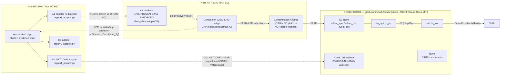

# 6G readiness — an honest assessment (no compliance claims)

_Assessment date: 2026-07-27. Every repository pointer below was verified to
exist in this tree on that date; every external link returned content when
retrieved on that date (see [Sources](#sources)). The claim discipline matches
the rest of the repo: nothing is described as validated unless the validating
artifact is named._

## 1. Status: there is no 6G specification, so there is no 6G compliance

**No 6G specification exists as of 2026-07-27. This document makes no 6G
compliance claim, and neither can anyone else.** The state of play:

- **ITU-R** approved [Recommendation ITU-R M.2160](https://www.itu.int/en/ITU-R/study-groups/rsg5/rwp5d/imt-2030/pages/default.aspx)
  ("Framework for IMT-2030") in November 2023. It is a *framework* — six usage
  scenarios, four overarching design principles, 15 capability dimensions —
  not a radio interface specification. Candidate IMT-2030 radio interface
  technology submissions are due to ITU-R in the window **02/2027–02/2029**.
- **3GPP Release 19** (the "bridge to 6G": ISAC channel modelling, AI/ML for
  the NR air interface, NTN evolution, network energy saving) was
  [frozen at the December 2025 meetings](https://firstnet.gov/newsroom/blog/3gpp-completes-release-19-while-progress-begins-6g-work).
- **3GPP Release 20** is the 6G *study* release — technical reports only, no
  normative 6G specifications. The RAN study on 6G scenarios and requirements
  (TR 38.914) was approved in June 2026, and 3GPP
  [approved the Release 21 timeline](https://techblog.comsoc.org/2026/06/16/3gpp-approves-timelines-for-release-21-which-will-specify-6g-ran-and-5g-advanced/):
  first functional freeze March 2027, checkpoint March 2028, second functional
  freeze June 2028, Stage-3 final freeze December 2028, code freeze March 2029.
  Only a handful of early technical directions are settled (CP-OFDM downlink
  waveform, largely reused 5G channel codes, 3–400 MHz bandwidths); the 5G→6G
  migration architecture itself was still open going into the September 2026
  TSG RAN #113 meeting.
- **Release 21** will contain the first normative 6G specifications. Until its
  freezes, "6G-compliant" is not a testable statement for any product, open
  source project, or vendor. That includes every vendor Horizon-RIC
  interoperates with today.

What "6G-ready" *can* honestly mean for this repository, and what this
document substantiates section by section:

1. **Alignment with the published direction artifacts** — the M.2160 usage
   scenarios (§2) and the Release-19 bridge features that 3GPP itself names as
   the on-ramp to 6G (§3), mapped to code that exists in this tree, with
   "not present" stated where it is true.
2. **Forward-compatible interfaces** — the I/O contract
   ([`../src/horizon_ric/io/schemas.py`](../src/horizon_ric/io/schemas.py)) is
   an additive modality registry with `extra="allow"` round-tripping, so new
   6G telemetry types are new literals + submodels, not schema breaks; and the
   Shield invariants are physics/regulatory properties (occupied bandwidth,
   EIRP, PFD) that survive a generation change, even though their normative
   anchors (e.g. 3GPP TS 38.104 §6.6 in
   [`../src/horizon_ric/shield/invariants.py`](../src/horizon_ric/shield/invariants.py))
   will need re-pointing at the 6G RF specification when it exists.
3. **Live-proven integration with the open-source substrate on which open 6G
   is being built** — the full Horizon pipeline has run against the real
   O-RAN SC A1 mediator and official `hw-python` xApp with 12/12 policies
   `ENFORCED` ([`../deploy/XAPP_E2E_PROOF.md`](../deploy/XAPP_E2E_PROOF.md)),
   and §4 lays out the concrete path onto the OCUDU CU/DU stack, whose source
   we verified is public today.

On the vendor question specifically: **no vendor offers 6G compatibility
today** because there is nothing to be compatible with. Horizon's vendor
surface is the five-dialect A1 matrix in
[`VENDOR_ONBOARDING.md`](VENDOR_ONBOARDING.md), with per-dialect validation
levels stated honestly (live OSC simulator / real-socket wire-contract /
offline mock-contract). That evidence discipline — never claim beyond the
strongest artifact — is exactly the discipline this document applies to 6G.

## 2. IMT-2030 usage scenarios × Horizon-RIC capabilities

The six M.2160 usage scenarios and four overarching design principles, against
what actually exists in this tree. "Not present" means not present.

| M.2160 usage scenario | Horizon-RIC today | Evidence in tree | Honest gap |
|---|---|---|---|
| **Immersive Communication (IC)** | Weak/indirect. Per-UE QoS telemetry (latency, throughput, BLER) and SLA-risk prediction are QoS-generic, not XR-specific. | `ue_qos` modality in [`io/schemas.py`](../src/horizon_ric/io/schemas.py); `sla_risk_*` fields of `PredictedOutcome` in [`evidence/schema.py`](../src/horizon_ric/evidence/schema.py) | No XR/immersive-specific model, KPI, or policy type. |
| **Hyper Reliable & Low-Latency Communication (HRLLC)** | Not present as a real-time capability. Horizon is a **non-RT rApp**; its risk horizons are 30 s / 1 min / 5 min. Its reliability contribution is indirect: fail-closed fallback of a neural receiver to the certified classical baseline. | `NeuralRxEnvelopeInvariant` in [`shield/invariants.py`](../src/horizon_ric/shield/invariants.py) | No sub-10 ms control path exists or is claimed; HRLLC-grade control belongs to the near-RT RIC / DU, not this rApp. |
| **Massive Communication (MC)** | Not present. Closest artifact is the multi-user DSA environment (n secondary users contending for channels), which is spectrum contention, not mMTC scale. | [`spectrum/dsa_env.py`](../src/horizon_ric/spectrum/dsa_env.py) | No mMTC/RedCap-class features. |
| **Ubiquitous Connectivity (UC)** | **Strong — this is a design centre.** NTN telemetry modalities, ephemeris ingestion, weather-driven propagation inputs, NTN capacity accounting, and a hard ITU-R-style PFD ceiling on LEO downlink power. | `kpm_ntn`, `tle`, `ephemeris_oem`, `weather_grib` modalities in [`io/schemas.py`](../src/horizon_ric/io/schemas.py); `PfdCeilingInvariant` + NTN slant-range sanity in [`shield/invariants.py`](../src/horizon_ric/shield/invariants.py); `ntn_capacity_used` / `ntn_capacity_exhausted` in [`evidence/schema.py`](../src/horizon_ric/evidence/schema.py) | Validated in simulation/replay only; no live satellite link has been in the loop. |
| **AI and Communication (AIAC)** | **Strong — this is the project's identity**, with one precision: M.2160's AIAC is about AI-native services in the network; Horizon supplies the *trust and audit layer* such AI-native operation will require. Federated aggregation robustness (Krum/median/trimmed-mean), Shamir + verifiable two-server secure aggregation, DP-FedAvg with a Rényi accountant, certified unlearning, model provenance signing, per-decision evidence. | [`federated/robust.py`](../src/horizon_ric/federated/robust.py), [`federated/secure.py`](../src/horizon_ric/federated/secure.py), [`federated/verifiable_secagg.py`](../src/horizon_ric/federated/verifiable_secagg.py), [`federated/dp.py`](../src/horizon_ric/federated/dp.py), [`federated/unlearning.py`](../src/horizon_ric/federated/unlearning.py), [`provenance/signing.py`](../src/horizon_ric/provenance/signing.py), [`evidence/`](../src/horizon_ric/evidence/) | Horizon does not itself provide AI-as-a-service to end users. |
| **Integrated Sensing & Communication (ISAC)** | **Identifier only.** `isac_radar` exists as a modality literal ("Rel-19 sensing returns") and nothing more: the `horizon_ric.io.payloads` module referenced in the schema docstring does not exist, and no code consumes or produces `isac_radar` events. | [`io/schemas.py`](../src/horizon_ric/io/schemas.py) line 33 (sole occurrence in `src/`) | No sensing payload schema, no sensing processing, no sensing invariants. This is the weakest cell in the matrix and is called out in the roadmap (§5, item 5). |

| M.2160 overarching aspect | Horizon-RIC today | Evidence in tree |
|---|---|---|
| **Security / privacy / resilience** | Core competency: Decision Safety Shield, threat model, RBAC/tenancy/HSM/JWT, O-RAN WG11-style mTLS/OAuth2 on A1/R1, NIS2 reporting, lawful intercept fail-closed constraint (TS 33.127). | [`shield/`](../src/horizon_ric/shield/), [`security/`](../src/horizon_ric/security/), [`rapp/auth.py`](../src/horizon_ric/rapp/auth.py), [`policy/li_constraint.py`](../src/horizon_ric/policy/li_constraint.py), [`THREAT_MODEL.md`](THREAT_MODEL.md) |
| **Ubiquitous intelligence** | Federated learning treated as a first-class, attackable, repairable system (poisoning, unlearning, DP), not a demo. | [`federated/`](../src/horizon_ric/federated/), [`spectrum/federated_q.py`](../src/horizon_ric/spectrum/federated_q.py) |
| **Sustainability** | Bookkeeping only: predicted `energy_kwh` per decision and `energy_cost` as a machine-readable rejection cause. Horizon *accounts for* energy in decisions; it does not implement energy-saving features (no cell sleep / carrier shutdown control). | `PredictedOutcome.energy_kwh` in [`evidence/schema.py`](../src/horizon_ric/evidence/schema.py); `energy_cost` in [`evidence/explanation.py`](../src/horizon_ric/evidence/explanation.py) and [`policy/counterfactual.py`](../src/horizon_ric/policy/counterfactual.py) |
| **Connecting the unconnected** | Only via the NTN/UC capabilities above; no coverage-economics features. | see UC row |

## 3. 3GPP Release 19/20/21 feature mapping

Release 19 is the last frozen release and the features 3GPP itself treats as
the 6G on-ramp. Every pointer below was checked to exist on 2026-07-27.

| 3GPP feature (release) | Horizon-RIC artifact | Honest status |
|---|---|---|
| **ISAC** — Rel-19 channel-modelling study (started Dec 2023, modelling finalised May 2025; see the [Rel-19 ISAC channel-modelling survey, arXiv:2512.03506](https://arxiv.org/pdf/2512.03506)) | `isac_radar` modality literal, [`io/schemas.py`](../src/horizon_ric/io/schemas.py):33 | **Hook, not capability.** One literal; no payload model (`io.payloads` does not exist), no producer, no consumer. |
| **AI/ML for the NR air interface** (Rel-18 study → Rel-19 work) | Neural receiver with hand-implemented backprop + PGD attack surface: [`phy/neural_rx.py`](../src/horizon_ric/phy/neural_rx.py), [`phy/pgd.py`](../src/horizon_ric/phy/pgd.py), [`phy/constellation.py`](../src/horizon_ric/phy/constellation.py); AI-PHY invariants (`NeuralRxEnvelopeInvariant` graded on independently-measured TBLER, `ConstellationLegalityInvariant`) in [`shield/invariants.py`](../src/horizon_ric/shield/invariants.py); AI-PHY lineage records in [`evidence/ai_phy_lineage.py`](../src/horizon_ric/evidence/ai_phy_lineage.py) | Horizon does **not** implement the 3GPP AI/ML use cases (CSI feedback, beam management, positioning). It implements the *safety envelope and audit trail* for neural PHY blocks — the part 3GPP's trustworthiness discussions ask for and vendors rarely ship. |
| **AI/ML management** — TS 28.105 | `ModelVersions` provenance fields ("Required by 3GPP TS 28.105") in [`evidence/schema.py`](../src/horizon_ric/evidence/schema.py); weights‖manifest signing in [`provenance/signing.py`](../src/horizon_ric/provenance/signing.py) | Provenance/version pinning implemented; no full 28.105 SBMA service surface. |
| **NTN evolution** (Rel-19 NR-NTN + IoT-NTN; see [FirstNet's Rel-19 summary](https://firstnet.gov/newsroom/blog/3gpp-completes-release-19-while-progress-begins-6g-work)) | `kpm_ntn`, `tle`, `ephemeris_oem` modalities; `PfdCeilingInvariant` (ITU-R RR Art. 21-style PFD mask) and NTN numeric-domain checks in [`shield/invariants.py`](../src/horizon_ric/shield/invariants.py) | Simulation/replay evidence only. Direct integration counterpart exists in OCUDU (`lib/ntn`: SIB19 helpers, `orbit_ephemeris_info`, orbital propagators — verified in the clone, §4). |
| **Network energy saving** (Rel-18/19 NES line) | `PredictedOutcome.energy_kwh`, `energy_cost` rejection cause ([`evidence/schema.py`](../src/horizon_ric/evidence/schema.py), [`evidence/explanation.py`](../src/horizon_ric/evidence/explanation.py)) | Energy is a *predicted, audited quantity* in every decision record, and an explicit rejection cause. Horizon does not command NES actions (cell sleep, carrier shutdown). |
| **KPI plumbing** — TS 28.552 / TS 28.554 | `kpm_5g` modality ("3GPP TS 28.552 KPI streams"), `PredictedOutcome` names aligned to TS 28.554 §6 | Implemented as the primary telemetry path of the live E2E proof. |
| **Lawful intercept** — TS 33.127 | [`policy/li_constraint.py`](../src/horizon_ric/policy/li_constraint.py) wrapped as `LawfulInterceptInvariant` | Fail-closed by default. |
| **Rel-20 6G studies** ([3GPP SA Rel-20 planning](https://www.3gpp.org/news-events/3gpp-news/sa-rel20)) | — | Nothing to implement: Rel-20 produces TRs only. Watch item. |
| **Rel-21 normative 6G** ([timeline](https://techblog.comsoc.org/2026/06/16/3gpp-approves-timelines-for-release-21-which-will-specify-6g-ran-and-5g-advanced/)) | — | First specs freeze 2027–2028. The settled CP-OFDM downlink decision suggests the occupied-bandwidth / EIRP invariant *logic* carries over; the normative anchors will change. |

## 4. OCUDU: what it is, what is public today, and the integration path

### 4.1 What it is

The **OCUDU Ecosystem Foundation** was
[announced by the Linux Foundation on 1 March 2026 at MWC Barcelona](https://www.linuxfoundation.org/press/linux-foundation-announces-ocudu-ecosystem-foundation-to-accelerate-open-source-ai-ran-innovation):
a neutral-governance home for an open-source **CU/DU (full L1/L2/L3) RAN
stack**, built from initial software by **DeepSig and Software Radio Systems
(SRS)** with funding from the **U.S. DoD FutureG Office and the National
Spectrum Consortium**, and based on **srsRAN Project** technology. Premier
members: AMD, AT&T, DeepSig, Ericsson, Nokia, NVIDIA, SoftBank, SRS, Verizon;
plus 21 general members (incl. T-Mobile, Cisco, Red Hat, Keysight, Viavi) and
17 research institutions. Its stated goal is a production-grade open CU/DU
supporting 5G and "AI-native 6G", complementing 3GPP, the O-RAN Alliance and
the AI-RAN Alliance — it is **not** itself a standards body, and it makes no
6G compliance claim either.

The srsRAN lineage is explicit:
[SRS announced that srsRAN Project development transitioned to OCUDU](https://www.srslte.com/press_releases/srsran_becomes_ocudu/)
(first OCUDU release 26.04; the
[srsRAN_Project GitHub repo](https://github.com/srsran/srsran_project) was
archived 1 June 2026, per its
[transition discussion](https://github.com/srsran/srsRAN_Project/discussions/1470)),
with the licence changing from AGPLv3 to permissive BSD.

### 4.2 What is public — findings as of 2026-07-27

**The OCUDU source is public.** Verified directly, not from press releases:
we shallow-cloned the GitHub mirror on 2026-07-27
(`git clone --depth 1 https://github.com/ocudu/ocudu`, HEAD
`9b0cfa600d9d69…`, last commit dated **2026-07-22** — actively developed):

| Fact | Finding |
|---|---|
| Canonical repo | `https://gitlab.com/ocudu/ocudu` (the [GitHub repo](https://github.com/ocudu/ocudu) is an official mirror); docs at `docs.ocudu.org`; governance repo `gitlab.com/ocudu/Governance`; project site [ocudu.org](https://ocudu.org/) |
| Licence | **BSD-3-Clause-Open-MPI** (LICENSE file, copyright 2021–2026 Software Radio Systems Limited — confirming the srsRAN lineage in the code itself) |
| Language / build | C++17, CMake; OpenSSF Best Practices badge; ~18.8k commits |
| CU/DU split | `apps/cu`, `apps/cu_cp`, `apps/cu_up`, `apps/du`, `apps/du_low`, `apps/gnb` — a real O-RAN CU-CP/CU-UP/DU decomposition plus a monolithic gNB |
| O-RAN interfaces in-tree | `lib/e2` with **E2SM-KPM, E2SM-RC, E2SM-CCC** service models (`lib/e2/e2sm/`), `lib/f1ap` + `lib/f1u` (F1), `lib/e1ap`, `lib/ofh` (Open Fronthaul), `lib/fapi_adaptor`; core-side `lib/ngap`, `lib/xnap`, `lib/nrppa` |
| NTN | `lib/ntn`: SIB19 helpers, `orbit_ephemeris_info`, orbital propagators, satellite-switch helpers — a direct counterpart to Horizon's `tle`/`ephemeris_oem`/`kpm_ntn` modalities |
| **Not found** | No O1/NETCONF termination module surfaced in our scan of the mirror — OCUDU's OAM/O1 surface is an open question for the roadmap. No near-RT RIC (OCUDU is the E2 *node*; the RIC comes from elsewhere, e.g. O-RAN SC). No A1 (an RIC interface, correctly absent from a CU/DU). No explicit "6G" code — the README says "5G (and beyond)". |

### 4.3 Integration architecture

Horizon-RIC's position does not change for OCUDU: it is a **non-RT rApp**
above the SMO/Non-RT RIC. What OCUDU adds is a fully open, permissively
licensed E2 node under the near-RT RIC that Horizon has already been proven
against. Everything marked **live-proven** below is backed by
[`../deploy/XAPP_E2E_PROOF.md`](../deploy/XAPP_E2E_PROOF.md); everything
marked **GAP** does not exist today.

Explicit gaps, stated once and plainly:

1. **Horizon has no E2 termination and will not grow one.** E2 is a near-RT
   interface; Horizon's contract is A1/O1/R1. Consuming OCUDU's E2SM-KPM
   telemetry requires a companion xApp on the near-RT RIC (roadmap #2) — the
   `hw-python` run already proves the RMR/xApp side of that path works.
2. **The live proof to date has no E2 node behind it** (its own scope section
   says so). OCUDU is precisely the missing piece, and it is public today.
3. **OCUDU's O1/YANG surface is unpublished/unknown** in our scan, so
   Horizon's `o1_adapter` (NETCONF/ncclient against TS 28.541 NRM + O-RAN
   WG10 YANG) currently has no OCUDU-specific target to validate against.

### 4.4 The rest of the open-source 6G-relevant ecosystem

- **O-RAN SC** — already Horizon's live-proven substrate: the official
  [`sim-a1-interface`](https://github.com/o-ran-sc/sim-a1-interface), the Go
  [A1 mediator (`ric-plt/a1`)](https://github.com/o-ran-sc/ric-plt-a1) and
  the `hw-python` reference xApp, all built from pinned commits in CI
  ([`../deploy/XAPP_E2E_PROOF.md`](../deploy/XAPP_E2E_PROOF.md) — including
  one disclosed upstream interop bug + patch).
- **OpenAirInterface (OAI)** — the main academic/industrial alternative RAN
  stack; 3GPP-compliant 5G with funded NTN adaptations (GEO/LEO,
  [ESA 5G-GOA/5G-LEO](https://connectivity.esa.int/sites/default/files/5G%20GOA%20(NTN%20OAI%20press%20release).pdf))
  and explicit positioning as a
  [6G-candidate-technology research platform](https://www.ni.com/en/solutions/electronics/5g-6g-wireless-research-prototyping/research-6g-technologies-using-openairinterface-software.html).
  A second E2-node target for the same companion-xApp path as OCUDU.
- **Aether (Linux Foundation, ex-ONF)** — cloud-native private-5G edge
  platform (SD-Core + O-RAN-compliant SD-RAN on Kubernetes),
  [moved to the LF in 2024](https://opennetworking.org/news-and-events/blog/onfs-aether-project-moving-to-lf/);
  relevant as a packaging/deployment substrate, not a RAN-stack alternative.
- **AI-RAN Alliance** — [132 members as of Feb 2026](https://ai-ran.org/press-releases/mwc-2026-momentum);
  working groups AI-for-RAN / AI-and-RAN / AI-on-RAN plus a
  [Data-for-AI initiative](https://www.rcrwireless.com/20250227/network-infrastructure/ai-ran-alliance)
  defining data-collection pipelines from real systems and simulators —
  the closest published counterpart to Horizon's `TelemetryEvent` bus, and
  the alliance this README already targets (Call for Innovation, §README).

## 5. Roadmap — prioritized, effort-labelled, honestly blocked

Effort scale: S ≈ days, M ≈ 1–3 weeks, L ≈ 4+ weeks of focused work.

| # | Priority | Item | Effort | Blocked on |
|---|---|---|---|---|
| 1 | **P1** | **OCUDU as the live E2 node.** Extend the existing `deploy/xapp-e2e/` harness: build OCUDU `gnb` (ZMQ/virtual RF) from the public GitLab source, attach it to the O-RAN SC near-RT RIC platform (E2term/e2mgr + the already-proven A1 mediator), and re-run the 12-event pipeline so the proof's "no E2 nodes" caveat is retired. | M | Nothing — all source is public today. |
| 2 | **P1** | **Companion E2SM-KPM consumer xApp.** A small `ricxappframe`-based xApp (same family as the proven `hw-python`) subscribing to OCUDU's `e2sm_kpm` indications and forwarding them to Horizon's existing Kafka/HTTP connectors ([`io/connectors/`](../src/horizon_ric/io/connectors/)) as `TelemetryEvent(modality="kpm_5g")`. Closes the telemetry loop end-to-end: real RAN → xApp → Horizon → A1 policy → same RAN. | M–L | Item 1 for a live target (development can start against recorded indications). |
| 3 | **P2** | **NTN cross-validation against OCUDU `lib/ntn`.** Feed OCUDU's SIB19/ephemeris structures into the `kpm_ntn`/`tle`/`ephemeris_oem` modalities and run the `PfdCeilingInvariant` over OCUDU NTN configurations — two independent NTN implementations checking each other. | M | Item 1. |
| 4 | **P2** | **O1/NETCONF against OCUDU YANG.** Point [`rapp/o1_adapter.py`](../src/horizon_ric/rapp/o1_adapter.py) at OCUDU's O1 surface and add a conformance test per the repo's existing yang-strict discipline. | S–M once unblocked | **Upstream:** OCUDU has no published O1/YANG surface that our scan found. Until then, validation stays on TS 28.541 NRM simulators. |
| 5 | **P2** | **Close the ISAC identifier-only gap.** Add `horizon_ric.io.payloads` with an `IsacRadar` submodel aligned to the Rel-19 ISAC channel-model outputs (the module the schemas docstring already promises), plus a synthetic producer so the modality is testable. Do not claim more: no 6G ISAC air interface exists to integrate with. | S | Nothing. |
| 6 | **P3** | **AI-RAN Alliance Data-for-AI alignment.** Map `TelemetryEvent`/`FeatureFrame` onto the Alliance's data-collection pipeline blueprints as they publish; position the evidence chain as the audit layer for their benchmarking data. | S–M | Blueprint availability (member-published cadence). |
| 7 | **P3** | **Release-21 watch.** Track Rel-21 drafts (freezes 2027–2028) and the September 2026 migration-architecture decision; re-anchor Shield invariant citations (TS 38.104 → 6G RF spec) when normative text exists. No 6G-normative work is possible before then, and none is claimed. | S (ongoing) | 3GPP calendar. |

## 6. Sources

All links retrieved 2026-07-27. Repository pointers verified by `ls`/`grep`
against this tree the same day; OCUDU code facts verified by shallow clone of
the GitHub mirror at commit `9b0cfa600d9d693bf56277e4575dc8c4b8b729bb`.

**ITU-R / IMT-2030**

- ITU-R WP 5D, [IMT towards 2030 and beyond (IMT-2030)](https://www.itu.int/en/ITU-R/study-groups/rsg5/rwp5d/imt-2030/pages/default.aspx) — Rec. M.2160 approval (Nov 2023), six usage scenarios, four design principles, 15 capabilities, 02/2027–02/2029 submission window.
- ITU-R, [IMT-2030 Framework common slide deck (Oct 2024)](https://www.itu.int/en/ITU-R/study-groups/rsg5/rwp5d/imt-2030/Documents/2024-October_Common%20slide%20deck%20(IMT-2030%20Framework).pdf).

**3GPP status**

- FirstNet Authority, [3GPP completes Release 19, while progress begins on 6G work](https://firstnet.gov/newsroom/blog/3gpp-completes-release-19-while-progress-begins-6g-work) — Rel-19 frozen Dec 2025; Rel-20 = 6G studies/TRs only; Rel-21 = first normative 6G.
- IEEE ComSoc Tech Blog, [3GPP approves timelines for Release 21…](https://techblog.comsoc.org/2026/06/16/3gpp-approves-timelines-for-release-21-which-will-specify-6g-ran-and-5g-advanced/) (16 Jun 2026) — Rel-21 freeze dates, TR 38.914 approval, CP-OFDM/channel-code decisions, migration decision deferred to Sept 2026.
- 3GPP, [Rel-20 Planning and Progress in TSG SA](https://www.3gpp.org/news-events/3gpp-news/sa-rel20).
- arXiv:2512.03506, [Survey of 3GPP Release 19 ISAC channel modeling](https://arxiv.org/pdf/2512.03506); arXiv:2506.11828, [5G-Advanced and 6G in 3GPP Release 20](https://arxiv.org/pdf/2506.11828); arXiv:2312.15174, [5G-Advanced evolution in Release 19](https://arxiv.org/pdf/2312.15174).

**OCUDU**

- Linux Foundation press release, [OCUDU Ecosystem Foundation announcement](https://www.linuxfoundation.org/press/linux-foundation-announces-ocudu-ecosystem-foundation-to-accelerate-open-source-ai-ran-innovation) (1 Mar 2026) — members, DeepSig/SRS/NSC/FutureG lineage, srsRAN basis.
- [ocudu.org](https://ocudu.org/) — foundation scope, full L1/L2/L3 claim, GitLab pointer, 60+ members.
- [github.com/ocudu/ocudu](https://github.com/ocudu/ocudu) (mirror of `gitlab.com/ocudu/ocudu`) — clone-verified: BSD-3-Clause-Open-MPI, C++17, CU/DU apps, E2SM-KPM/RC/CCC, F1/E1/OFH, `lib/ntn`, last commit 2026-07-22.
- SRS, [OCUDU 26.04: the next chapter for srsRAN](https://www.srslte.com/press_releases/srsran_becomes_ocudu/); [srsRAN_Project archive notice + transition discussion](https://github.com/srsran/srsRAN_Project/discussions/1470); DeepSig, [DoD FutureG OCUDU award](https://www.deepsig.ai/deepsig-and-srs-chosen-by-dod-futureg-office-to-lead-ocudu-the-open-source-5g-6g-ran-initiative/); DoD R&E, [OCUDU announcements](https://rt.cto.mil/linux-foundation-announces-ocudu-ecosystem-foundation-to-accelerate-open-source-ai-ran-innovation/).

**Other open source / alliances**

- O-RAN SC components pinned and live-proven in [`../deploy/XAPP_E2E_PROOF.md`](../deploy/XAPP_E2E_PROOF.md): [`sim-a1-interface`](https://github.com/o-ran-sc/sim-a1-interface), [`ric-plt/a1`](https://github.com/o-ran-sc/ric-plt-a1), `hw-python`.
- OAI NTN: [ESA 5G-GOA/5G-LEO press release](https://connectivity.esa.int/sites/default/files/5G%20GOA%20(NTN%20OAI%20press%20release).pdf); [IEEE paper: OAI as a platform for 5G-NTN research](https://ieeexplore.ieee.org/document/10056682/); OAI for 6G research: [NI/Emerson overview](https://www.ni.com/en/solutions/electronics/5g-6g-wireless-research-prototyping/research-6g-technologies-using-openairinterface-software.html).
- Aether: [ONF blog — Aether moving to the Linux Foundation](https://opennetworking.org/news-and-events/blog/onfs-aether-project-moving-to-lf/); [aetherproject.org](https://aetherproject.org/).
- AI-RAN Alliance: [MWC 2026 momentum release](https://ai-ran.org/press-releases/mwc-2026-momentum) (132 members); RCR Wireless, [working groups + Data-for-AI](https://www.rcrwireless.com/20250227/network-infrastructure/ai-ran-alliance).
