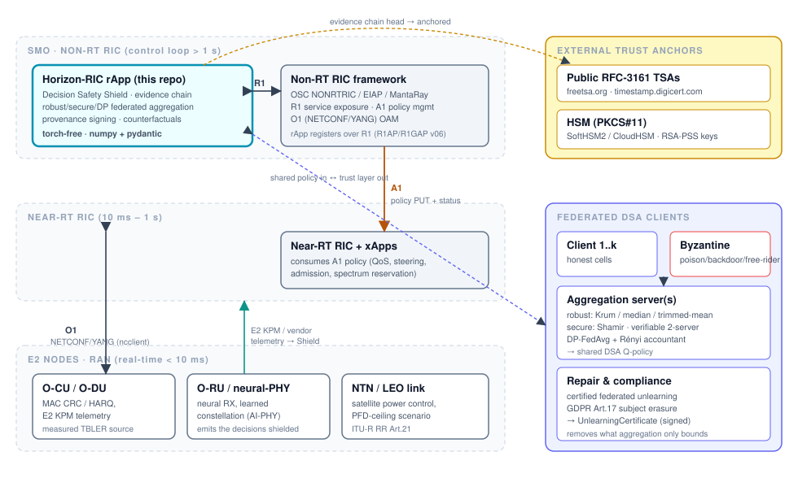
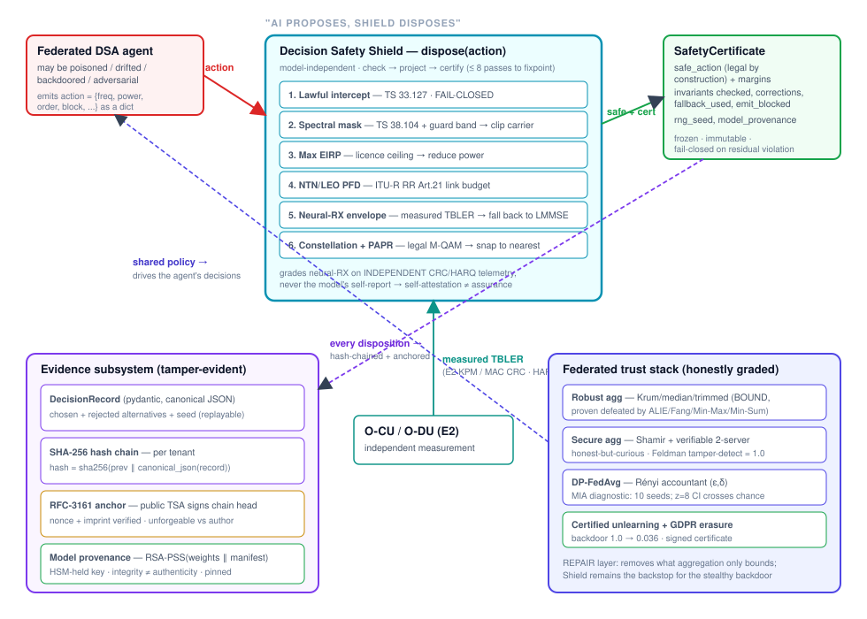

**Repository:** `Danielfoojunwei/PreceptualAI-Horizon-RIC`\
**Report version:** 2.0\
**Report date:** 25 July 2026\
**Status:** repository technical report; not an independent laboratory report\
**Machine-readable claim register:** [`CLAIMS_EVIDENCE.json`](CLAIMS_EVIDENCE.json)

> This report distinguishes executable repository evidence from external
> validation. “Verified” below always means verified under the stated software,
> data and test conditions. It does not mean certified, field-proven,
> carrier-grade or independently validated.

---

## 1. Executive answer: what is proven

The repository establishes the following limited propositions:

1. **Programmed Shield invariants hold over the exercised inputs.** For a
   terrestrial action, the Shield either fails closed or returns an action that
   satisfies every invariant in its configured chain. A Hypothesis test explores
   500 randomized finite actions, while separate generated cases inject NaN,
   infinities, strings and nulls. The new numeric-domain invariant blocks
   malformed or non-physical values before ordinary comparisons can mishandle
   them.
2. **A reproducible external-data DSA experiment exists.** A pinned DeepMIMO
   4.0.0 pipeline downloads the public `asu_campus_3p5` ray-tracing scenario,
   hashes the archive and every extracted file byte, generates channel features
   for 4,096 receivers, and reproduces the committed aggregate results in CI.
3. **The reported differential-privacy bound is correctly scoped to one
   mechanism invocation.** The Gaussian mechanism uses a public clipping bound
   $C=12$, conservative replace-one client sensitivity $2C=24$, and a
   Rényi-DP accountant. It reports one-round $(\varepsilon,\delta)$ values,
   not an end-to-end privacy claim.
4. **The membership-inference result is now a meaningful diagnostic, but not a
   proof.** Each independent seed uses 64 members and 64 non-members; the report
   aggregates 10 seeds and gives seed-level bootstrap intervals. The earlier
   eight-versus-eight result and its `0.469` point estimate are retired.
5. **Two-server collusion has an explicit mitigation mode.** Exact additive
   sharing still reveals raw updates if both servers collude. In the opt-in
   local-DP mode, each client clips and Gaussian-noises its update before
   sharing, so colluding servers reconstruct the stated DP release rather than
   the raw update. The large measured utility distortion is reported.
6. **An actual open-source OSC interoperability gate exists.** A GitHub Actions
   job builds the official O-RAN-SC A1 simulator from a pinned source commit and
   exercises policy-type registration, policy create, list, status and delete
   over OSC 2.1.0. This proposition is established for a commit only when that
   live CI job passes.
7. **A measured local control-path baseline exists.** On the recorded host, the
   in-process Shield and certificate path processed 50,000 decisions with zero
   blocked post-projection decisions and a measured p99 of 40.399 μs. This is a
   single-process microbenchmark, not carrier-scale evidence.
8. **The DSA and LEO/PFD work streams exist as executable software
   demonstrators.** The DSA path now includes externally sourced ray-tracing
   data. The LEO path includes a PFD invariant and tests. Neither is a completed
   over-the-air or operator demonstrator.

These propositions are supported by source, tests, committed JSON results and
reproduction workflows. They are narrower than the product-level claims that
would require an operator, vendor, accredited laboratory or certification body.

### Evidence classes

| Label | Meaning |
|---|---|
| Verified—repository | Executable test or committed benchmark under declared conditions |
| Verified—external dataset | Public source is pinned and hash-checked; transformation and aggregate output reproduce |
| CI external simulator | A real external simulator is exercised; valid only if the job passes for the reviewed commit |
| Repository demonstrator | Working software exists; field completion does not |
| Not established | Required evidence is absent |

---

## 2. What is not proven

The following claims remain **not established**:

- **Live O-RAN operation, real radios or operator traffic.** No operator/testbed
  run or radio capture is present. Closing this requires a named testbed,
  topology, calibrated equipment, traffic description and raw signed logs.
- **Interoperability with deployed OSC, Ericsson or Nokia platforms.** The new
  live test covers the official OSC A1 simulator only; Ericsson/Nokia tests use
  `httpx.MockTransport`. Closing this requires identified product versions,
  deployment records and end-to-end results.
- **Coverage of every unsafe RF behaviour.** Only enumerated and configured
  invariants are guaranteed. A complete, independently reviewed hazard analysis,
  calibration and traceability are absent.
- **Formal O-RAN, 3GPP, ITU-R, GDPR, NIS2 or telecom
  compliance/certification.** Standards references and engineering controls
  are not certification. Jurisdiction-specific legal review and competent
  conformity assessment are required.
- **Security against unknown attacks or arbitrary compromised components.**
  Tests exercise named threat models. A broader red-team program, component
  compromise analysis and continuing vulnerability evidence are required.
- **Exact-mode secrecy when both secure-aggregation servers collude.** Two
  shares reconstruct the exact submitted update. Use the local-DP mode or a
  different cryptographic trust model.
- **Carrier-scale latency, throughput, availability or scalability.** The
  committed timing result is one local process without network or platform I/O.
  Representative multi-node load, endurance, capacity and failover tests are
  required.
- **Global novelty of the evidence-binding design.** No systematic prior-art
  search or peer review was performed.
- **Independent external validation.** No reviewer identity, credentials,
  signed raw logs or external laboratory report is included.
- **Completed field DSA or LEO demonstrator.** Current demonstrations are
  software/ray-tracing based. OTA/testbed acceptance evidence is absent.

The report therefore makes no claim of certification, production readiness,
commercial-vendor interoperability, global novelty or independent review.

---

## 3. System and assurance boundary

Horizon-RIC implements an “AI proposes, Shield disposes” control pattern. A
possibly learned policy proposes an action; a deterministic Shield checks and
projects it; a safety certificate records the outcome; an adapter can then emit
the accepted policy.





The assurance boundary is important:

- The Shield reasons about the fields and context it receives.
- It enforces only the invariants present in the configured chain.
- Correct calibration of bands, power limits, PFD limits and independent
  telemetry remains a deployment responsibility.
- Tests and simulations do not establish what happens after a real RIC, radio
  unit or operator network accepts a policy.

---

## 4. Decision Safety Shield

### 4.1 Enforced mechanism

`src/horizon_ric/shield/shield.py` applies an ordered check–project–recheck loop.
If a projection cannot produce a state satisfying every configured invariant
within the bounded number of passes, the action is marked `emit_blocked`.

The terrestrial chain now begins with `NumericSanityInvariant`, followed by the
configured spectrum, power and AI-PHY controls. The numeric invariant requires:

- finite positive frequency and bandwidth;
- finite transmit power and antenna gain;
- bounded probabilities/confidences when supplied;
- non-negative PAPR and a positive integer constellation order; and
- a finite positive slant range for NTN actions.

Malformed evaluation or projection raises no control-path exception: the Shield
constructs a failed check, marks the action blocked and returns a certificate
with `safe=false`.

### 4.2 Executable property

`tests/test_shield_properties.py` expresses the actual guarantee:

> For every generated action in the exercised input domain, if the Shield allows
> emission, every programmed invariant in the returned certificate is satisfied.

The test independently checks occupied bandwidth, maximum EIRP, legal
constellation order and PAPR. It also generates non-finite and malformed fields
and requires fail-closed behavior.

This is strong evidence for the implementation property. It is not evidence that
the invariant list is a complete model of RF safety or that deployment constants
match a particular licence.

### 4.3 Existing adversarial result

The committed poisoned-stream benchmark still reports 1,983 out-of-spec and 489
in-spec-but-harmful unguarded decisions, versus zero after the configured Shield
over 10,000 generated decisions. That result demonstrates the benchmarked
invariants and oracle; it does not generalize to all RF hazards.

---

## 5. External DeepMIMO dataset and DSA result

### 5.1 Data source and dependency

The new pipeline uses [DeepMIMO v4.0.0](https://github.com/DeepMIMO/DeepMIMO/releases/tag/v4.0.0)
and its published [ASU Campus 3.5 GHz scenario workflow](https://deepmimo.net/docs/tutorials/1_getting_started.html).
DeepMIMO supplies site-specific Wireless InSite ray-tracing data. It is not an
OTA capture.

The dependency is pinned in the `realdata` extra:

```toml
deepmimo==4.0.0
```

The generated manifest records scenario `asu_campus_3p5`, DeepMIMO release
commit `cbe3a3eae426d0d0a2bd1fdf95ce011c536a3dd9`, a sample of 4,096 receivers
from 85,157 receivers with finite paths, and this transform: SISO isotropic,
3.5 GHz, 100 MHz, 1,024 total / 60 selected OFDM subcarriers, six subbands.

**Downloaded archive SHA-256**

`80e4a4983847023158ed61a5a489025d72f4edcdac89edf4ee1323699e1b7da3`

**Extracted tree SHA-256**

`42f9c6eb8f4b4c467fe04c63ae910ae26c75706b85c7decdbcb3a002cb5466b7`

**Derived feature SHA-256**

`ab4414a1dca5d1247f28908003003239033ab329ea04cf2f481a37132969e5af`

Dataset lineage hashes each file’s relative path, size and byte SHA-256. A test
replaces a file with different bytes of the same size and requires the dataset
hash to change, closing the old name-and-size-only weakness.

The downloaded scenario archive did not contain a separate dataset licence
file. Raw data and row-level derived features are therefore not redistributed.
CI downloads them from the provider; only aggregate results and provenance
hashes are committed.

### 5.2 Measured DSA result

The benchmark compares four deterministic subband-selection strategies:

| Strategy | Decisions | Mean regret | p95 regret | Illegal post-Shield emits |
|---|---:|---:|---:|---:|
| Best subband | 4,096 | 0.000 dB | 0.000 dB | 0 |
| Fixed subband 0 | 4,096 | 1.730 dB | 5.733 dB | 0 |
| Seeded random | 4,096 | 1.726 dB | 5.485 dB | 0 |
| Worst subband | 4,096 | 3.702 dB | 8.835 dB | 0 |

The proposed power deliberately exceeds the configured EIRP ceiling, so all
16,384 strategy decisions are projected by the Shield. This tests the DSA
selection and configured power invariant on external ray-traced channels. It
does not test interference dynamics, a real scheduler, radios or operator
traffic.

---

## 6. Differential privacy and membership inference

### 6.1 Formal mechanism statement

`src/horizon_ric/federated/dp.py` clips each participating client vector to a
public L2 bound $C$ and calibrates the Gaussian standard deviation to

$$
\sigma = z \cdot 2C
$$

for replace-one client adjacency. A Rényi-DP accountant, following
[Mironov (CSF 2017)](https://doi.org/10.1109/CSF.2017.11), converts the
one-step RDP values to $(\varepsilon,\delta)$.

The formal statement is limited to the declared one-round Gaussian mechanism,
public clipping rule, adjacency model and accounting parameters. Composition
must include every later release before any lifecycle privacy claim can be made.

### 6.2 Corrected experiment

The previous report’s eight-member/eight-non-member AUC was underpowered and is
not retained as evidence. The replacement uses:

- 64 members and 64 non-members per cohort;
- 10 independently seeded cohorts;
- disjoint seed bands for members and non-members;
- 10,000 seed-level bootstrap resamples; and
- a fixed, public $C=12$, independent of the sampled cohorts.

| Noise multiplier $z$ | One-round ε at δ=1e-5 | MIA AUC mean | Seed-level 95% CI | Throughput/slot |
|---:|---:|---:|---:|---:|
| 0 | no guarantee | 0.5974 | [0.5481, 0.6420] | 1.2318 |
| 1 | 5.3026 | 0.5507 | [0.5121, 0.5875] | 1.1000 |
| 4 | 1.2675 | 0.5263 | [0.5005, 0.5513] | 0.4756 |
| 8 | 0.6214 | 0.5207 | [0.4696, 0.5647] | 0.1885 |

The z=8 interval crosses chance. That means this particular proximity attacker
did not reliably distinguish these cohorts; it does **not** prove privacy.
Privacy evidence comes from the stated DP mechanism and accountant, while the
AUC is an empirical attack diagnostic.

---

## 7. Secure aggregation and collusion

Exact mode uses two-of-two additive shares and public Feldman commitments over
the [RFC 3526 group-14 modulus](https://www.rfc-editor.org/rfc/rfc3526).
The committed test suite reports:

- all honest fixed-point aggregates verified;
- tamper detection rate 1.0 over 200 trials; and
- dropped-share detection rate 1.0 over 200 trials.

Those results establish the tested integrity behavior. Exact-mode privacy still
depends on non-collusion: together, the two servers reconstruct every submitted
value.

`split_private_contribution` adds an explicit alternative:

1. clip locally to public $C$;
2. add client-side Gaussian noise using replace-one sensitivity $2C$;
3. secret-share and commit to the noisy release; and
4. publish the local-DP metadata with the contribution.

In the committed 16-client, eight-dimensional probe with $C=12$, $z=4$ and
$\delta=10^{-5}$, the one-release bound is $\varepsilon=1.2675$. The mean L2
distance from a raw update to the colluding view is 258.2725, and mean aggregate
error is 68.8738. The result makes the trade-off explicit: colluding servers see
a private release, but utility distortion is material.

This does not cover broken client randomness, compromised clients, unaccounted
composition, side channels or unknown attacks.

---

## 8. O-RAN interoperability evidence

### 8.1 Official OSC simulator

The adapter now separates two interfaces that were previously easy to conflate:

- `osc`: the OSC Non-RT RIC Policy Management Service northbound API; and
- `osc_a1`: the OSC 2.1.0 nested A1 interface implemented by the official
  Near-RT RIC simulator.

The live workflow fetches
[o-ran-sc/sim-a1-interface at `be2943f5…`](https://github.com/o-ran-sc/sim-a1-interface/commit/be2943f57211f62095dc5434099e331df237aafb),
builds its container, starts `A1_VERSION=OSC_2.1.0`, waits on
`/a1-p/healthcheck`, and uses Horizon-RIC to:

1. register all four policy types;
2. create a QoS policy;
3. confirm it appears in the list;
4. retrieve an enforcement-status body;
5. delete the policy; and
6. confirm it no longer appears.

The upstream Dockerfile is first verified against its expected SHA-256. The CI
recipe then relaxes only its obsolete exact Alpine `python3` package-revision
pin; application source and the upstream Flask/Connexion pins are unchanged.

The O-RAN-SC repository describes the component as a simulator. Accordingly,
even a passing CI result is evidence of open-source simulator REST
interoperability—not a live OSC platform, a real RIC, conformance or production
readiness.

### 8.2 Ericsson and Nokia

The EIAP and MantaRay suites replace the HTTP transport with
`httpx.MockTransport`. They verify paths and payload shapes in repository code;
they do not communicate with deployed Ericsson or Nokia systems. This report
does not call them vendor interoperability tests.

---

## 9. Local performance evidence

`benchmarks/control_plane_load_suite.py` measures the in-process Shield and
certificate-construction path on deterministic valid/projectable inputs:

| Field | Result |
|---|---:|
| Timed decisions | 50,000 |
| Warm-up decisions | 1,000 |
| Projected decisions | 33,334 |
| Blocked decisions after projection | 0 |
| Mean latency | 25.457 μs |
| p50 / p95 / p99 | 28.342 / 29.875 / 40.399 μs |
| Throughput | 38,932 decisions/s |
| Recorded host | CPython 3.12.13, AMD EPYC 9V74, Linux x86-64 |

The benchmark excludes SMO, RIC, radio, network, database and multi-node I/O.
It includes no failover, endurance or availability measurement. The maximum
sample of 2.930 ms also shows why a distribution matters more than only a mean.
No carrier-grade conclusion follows from this result.

---

## 10. Evidence, lineage and provenance

The evidence store canonicalizes each `DecisionRecord` and computes

$$
H_i = \operatorname{SHA256}(H_{i-1} \parallel \operatorname{canonicalJSON}(R_i)).
$$

Per-tenant chains and serialized append operations prevent cross-tenant
verification coupling and the reproduced concurrent-append race. RFC-3161
support can externally timestamp a chain head, addressing the limitation that a
chain author could otherwise rewrite all records and hashes.

Model provenance signs the weights hash, manifest hash and trainer identity and
checks the embedded key against a trusted key. Dataset provenance now hashes
content bytes as well as paths and sizes.

These controls support integrity and traceability under their key-management,
timestamp-authority and storage assumptions. They do not themselves establish
legal admissibility, retention compliance, non-repudiation in every
jurisdiction, or external validation.

---

## 11. Other repository evidence

The repository also contains:

- tabular federated DSA, robust aggregation and named poisoning campaigns;
- certified client unlearning and subject-tagged erasure experiments;
- a NumPy neural receiver with finite-difference gradient tests;
- white-box and black-box evasion experiments;
- a classical-receiver fallback path;
- RBAC, JWT rotation, HSM abstractions, incident reporting and evidence stores;
- YANG parsing gates and build/SBOM workflows; and
- executable LEO/PFD invariant tests.

These are meaningful implementation and laboratory artifacts. Their detailed
results remain scoped to the source, parameters and test environments. A
passing unit test or simulator benchmark is not substituted for operational,
regulatory or independent evidence.

---

## 12. Compliance and novelty position

The source maps some controls to O-RAN, 3GPP, ITU-R, GDPR and NIS2 concepts.
That traceability may help prepare an assurance case, but this report does not
interpret it as formal compliance. For example, implementing incident timers
that resemble NIS2 reporting periods does not establish that the organization
meets all duties under the
[NIS2 Directive](https://eur-lex.europa.eu/eli/dir/2022/2555/oj), and an erasure
experiment does not by itself establish compliance with the
[GDPR](https://eur-lex.europa.eu/eli/reg/2016/679/oj).

Likewise, the report makes no global novelty claim for decision-level evidence
binding. Cryptographic logging, runtime assurance, provenance and safety
certificates all have substantial prior art. A global novelty conclusion
requires a systematic literature and patent search plus peer review.

---

## 13. Reproduction

### 13.1 Fast repository checks

```bash
python3 -m venv .venv
.venv/bin/python -m pip install -e ".[dev,oran,otel,persistence]"
.venv/bin/python -m pytest tests/ -m "not integration and not slow" -q
.venv/bin/ruff check src/ tests/ benchmarks/ scripts/
```

### 13.2 External DeepMIMO result

```bash
.venv/bin/python -m pip install -e ".[realdata]"
.venv/bin/python datasets/deepmimo_asu_3p5/build.py
.venv/bin/python benchmarks/deepmimo_dsa_benchmark.py
```

CI regenerates both the manifest and aggregate result in temporary storage and
requires byte-for-byte equality with the committed JSON.

### 13.3 Privacy, collusion and local load

```bash
.venv/bin/python benchmarks/dp_privacy_suite.py
.venv/bin/python benchmarks/verifiable_secagg_suite.py
.venv/bin/python benchmarks/control_plane_load_suite.py
```

### 13.4 Live OSC A1 simulator

The reproducible entrypoint is
`.github/workflows/osc-a1-integration.yml`. A local Docker host can follow the
same steps: build the pinned official simulator source, expose port 8085, then
run:

```bash
.venv/bin/python scripts/osc_a1_live_smoke.py \
  --base-url http://127.0.0.1:8085
```

---

## 14. Required external validation package

To advance beyond repository evidence, a future validation package should
contain:

1. reviewer and institution identity, competence and conflict disclosure;
2. exact reviewed commit, dependency lock/SBOM and signed container digest;
3. operator/testbed topology, hardware, radio configuration and calibration;
4. actual OSC/Ericsson/Nokia versions and endpoint configuration;
5. raw timestamped logs, captures, workload generators and result hashes;
6. hazard analysis linking each safety requirement to an invariant and test;
7. privacy composition across the full training/release lifecycle;
8. capacity, saturation, endurance, failover and recovery results;
9. jurisdiction-specific standards/legal assessment; and
10. signed conclusions with explicit exceptions.

Until such a package exists, the strongest accurate description is:

> Horizon-RIC is a tested repository-level runtime-assurance and evidence
> demonstrator with a reproducible public ray-tracing benchmark and an
> official open-source OSC simulator gate. It is not yet a field-validated,
> certified, carrier-grade or independently validated RIC product.
