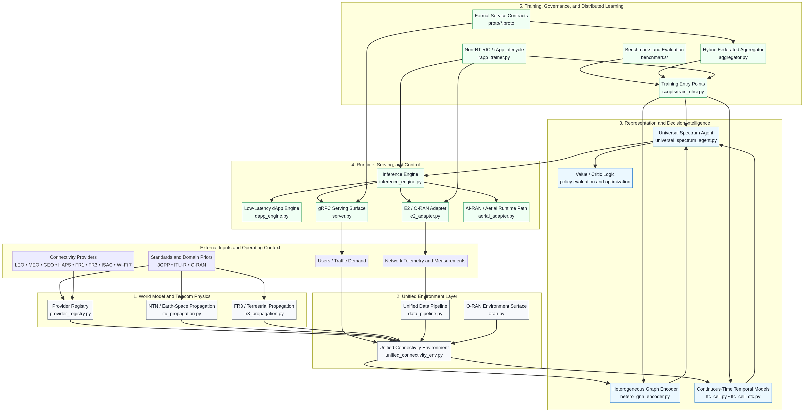
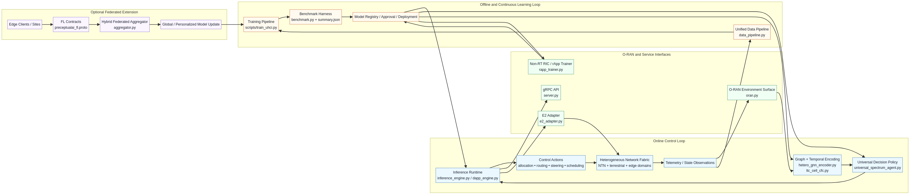

# PreceptualAI UHCI 架构参考文档

**作者：** Manus AI  
**仓库：** `Danielfoojunwei/PreceptualAI-Universal-Heterogeneous-Connectivity-Intelligence-UHCI-`

## 引言

本文档提供对 **PreceptualAI Universal Heterogeneous Connectivity Intelligence (UHCI)** 的完整架构解读。本文被写作一份系统级参考文档，面向那些不仅需要理解该仓库**包含什么**，还需要理解**主要子系统如何协同工作、所选技术为何在技术上合理、哪些标准与研究参考支撑这一设计，以及如何依据代码库重构完整端到端 UHCI 技术栈**的读者。[1] [2] [3] [4] [5] [6] [7] [8] [9] [10] [11] [12] [13] [14] [15] [16]

本次架构审查的核心结论是：该仓库最适合被理解为一个**多层连接智能平台**，而不是一个狭义的强化学习项目。它将提供方本体、具备通信物理约束的传播建模、统一控制环境、异构图表示层、连续时间时序智能、通用决策策略、低延迟运行时接口、O-RAN 集成表面、非实时生命周期治理以及可选的联邦学习整合为一个连贯的系统架构。[1] [2] [3] [4] [5] [6] [7] [8] [9] [10] [11] [12] [13] [14] [15] [16] [17] [18] [19] [20]

| 架构问题 | 简短回答 |
|---|---|
| UHCI 解决什么问题？ | 它为异构的地面、非地面与混合连接决策创建一个统一的智能层。 |
| 它为何不同于狭义 RL 基准？ | 该仓库包含世界建模、传播建模、结构表示、服务化、通信控制平面集成、治理和分布式学习接口。 |
| 为什么现在这个架构很重要？ | AI-native RAN、O-RAN 可编程性、AI-RAN 基础设施，以及异构连接压力，正在 5G-Advanced 与 6G 工作流中汇合。[21] [22] [23] [24] [25] [26] [27] |
| 为什么这个技术栈是可辩护的？ | 因为它让建模选择与无线问题本身的结构相匹配，而不是把一切强行压缩成扁平环境或离线训练循环。 |

## 系统目标

UHCI 的架构目标，是在**多个在物理规律、提供方身份与控制语义上彼此不同的连接域之间实现决策能力**，同时仍暴露出一种能够适配近实时推理、非实时生命周期管理，以及分布式或联邦式部署场景的执行模型。[1] [2] [3] [10] [11] [12] [14] [15] [19] [20]

这一点之所以重要，是因为现代无线部署已经不再运行于单一、同质的资源池中。真实系统越来越多地结合地面无线、非地面平台、边缘计算资源以及软件定义控制表面。因此，一个控制器必须在更广泛的状态空间上进行推理，其中包括时延范围、传播条件、覆盖几何、共存行为以及编排约束，而不仅仅是简单的瞬时信道占用。[1] [7] [8] [21] [22] [23] [24]

> “原生人工智能（AI）是 6G 的使能技术。O-RAN 的无线接入网智能控制器（RIC）是实现原生 AI 的潜在路径。” — *O-RAN next Generation Research Group, RR-2023-02* [25]

> “统一的数据摄取模型正在成为一项关键要求。” — *O-RAN next Generation Research Group, RR-2023-03* [26]

这些表述尤其相关，因为该仓库同时包含**统一数据路径**与**面向 RIC 的执行和生命周期叙事**，这意味着其实现方向与向 AI-native 无线控制迁移的更广泛趋势是一致的。[9] [13] [14] [15] [25] [26] [27]

## 总体架构

仓库将 UHCI 组织为一个分层系统。下图展示了从输入与领域先验，到运行时与生命周期控制的完整架构。

该架构不是一个单体模型，而是一个由**协同层级构成的流水线**，每一层都承担不同的系统职能。提供方层与物理层定义世界是什么样子；环境层与数据层定义世界如何被转换为控制问题；图层与时间层定义复杂状态如何被表示；策略层定义动作如何被选择；运行时与治理层定义这些动作如何被服务化、集成、监控并随时间改进。[1] [2] [3] [4] [5] [6] [7] [8] [9] [10] [11] [12] [13] [14] [15] [18] [19] [20]

| 层级 | 核心功能 | 主要代码锚点 | 架构含义 |
|---|---|---|---|
| 提供方本体 | 定义异构提供方类别及其先验 | `provider_registry.py` [1] | 建立连接选择的设计空间 |
| 通信物理 | 建模地面与 NTN 传播行为 | `itu_propagation.py`, `fr3_propagation.py` [7] [8] | 将控制问题锚定在真实无线行为上 |
| 统一环境 | 构建观测、动作、奖励与状态转移 | `unified_connectivity_env.py` [2] | 将世界转换为可学习的决策过程 |
| 数据摄取 | 规范化并路由更丰富的运行输入 | `data_pipeline.py` [9] | 将架构连接到经验型通信数据 |
| 结构表示 | 编码类型化节点、链路与关系 | `hetero_gnn_encoder.py` [4] | 保留系统结构，而不是将其扁平化 |
| 时间智能 | 建模不规则、混合时间尺度的状态演化 | `ltc_cell.py`, `ltc_cell_cfc.py` [5] [6] | 为策略提供自适应时间记忆 |
| 决策策略 | 产生学习得到的控制动作 | `universal_spectrum_agent.py` [3] | 实现核心 UHCI 控制器 |
| 运行时与服务化 | 执行并暴露低延迟推理 | `inference_engine.py`, `dapp_engine.py`, `server.py` [10] [11] [12] | 使智能体可在运行场景中被调用 |
| O-RAN 控制接口 | 将模型输出桥接到 RAN 控制语义 | `oran.py`, `e2_adapter.py` [13] [14] | 将学习结果连接到可编程控制闭环 |
| 生命周期治理 | 管理审批、监控、再训练与发布 | `rapp_trainer.py` [15] | 将模型管理视为系统的一部分 |
| 联邦扩展 | 聚合多站点学习更新 | `aggregator.py`, `preceptualai_fl.proto` [19] [20] | 将 UHCI 扩展到分布式部署环境 |

## 子系统逐项说明

### 提供方本体与异构世界建模

第一个架构子系统是**提供方本体**，核心位于 `provider_registry.py`。该模块之所以重要，是因为它决定了**控制器被允许对什么进行推理**。仓库并没有把世界建模为一个由可互换信道组成的抽象池，而是形式化了诸如 **LEO、MEO、GEO、HAPS、FR1、FR3、ISAC 和 Wi‑Fi 7** 等类别，并为其分配了时延倾向、覆盖范围、切换假设、带宽和部署先验等属性。[1]

这一设计选择显著改变了问题的表述方式。如果世界本身是异构的，那么控制器就必须保留不同连接选项的身份与语义。因此，提供方层成为原始无线多样性与其余学习技术栈之间的架构边界。

| 提供方子系统的贡献 | 为什么重要 |
|---|---|
| 显式编码提供方类别 | 防止所有链路被当作等价对象处理 |
| 将结构化先验与每一类提供方类型绑定 | 为技术栈其余部分提供语义明确的约束 |
| 在同一抽象中支持地面与非地面推理 | 使其能够讲述比传统 DSA 更广泛的连接智能故事 |

### 通信物理与传播建模

第二个子系统是**传播层**，包含 `itu_propagation.py` 与 `fr3_propagation.py`。[7] [8] 这些模块之所以关键，是因为真实网络决策依赖于物理行为，而不只是奖励函数。仓库中的传播层将控制问题与地面及地空通信相关的通信建模假设联系起来。

这一架构与仓库所暗含的标准背景是一致的。非地面侧自然对应 **3GPP TR 38.821**，即面向 NR 支持非地面网络解决方案的技术报告，以及 **ITU-R P.618**，即地空通信系统设计所需传播数据与预测方法的建议书。[21] [23] 地面侧自然对应 **3GPP TR 38.901**，该标准研究了 0.5 到 100 GHz 的信道模型。[22]

| 传播参考 | 架构相关性 |
|---|---|
| 3GPP TR 38.821 [21] | 为非地面网络假设与异构 NTN 提供方建模提供标准锚点 |
| 3GPP TR 38.901 [22] | 为地面与宽频段信道建模推理提供标准锚点 |
| ITU-R P.618 [23] | 为地空传播建模提供标准锚点 |

### 统一环境与数据管线

第三个子系统是**统一环境层**，核心位于 `unified_connectivity_env.py`，并由 `data_pipeline.py` 与 `oran.py` 扩展。[2] [9] [13] 在这一层中，仓库将一个异构无线世界转换成正式的控制过程。观测、动作空间、奖励和状态转移由提供方与传播逻辑共同构造，从而使智能层运行在一个连贯的决策表面之上。

数据管线尤其重要，因为 O-RAN 的跨域 AI 报告强调，下一代无线系统必须处理**跨多个层级的大量异构数据**，而且**统一数据摄取模型**正在成为关键的架构要求。[26] 专门存在的 `data_pipeline.py` 强有力地支持了这样一种解释：该仓库是为更丰富的真实数据工作流而设计的，而不仅是为合成仿真而设计。[9] [26]

| 环境层文件 | 主要架构作用 |
|---|---|
| `unified_connectivity_env.py` | 定义核心学习环境与操作性控制语义 |
| `data_pipeline.py` | 为更真实的运行场景摄取并规范化数据 |
| `oran.py` | 将环境扩展为面向 O-RAN 的控制语义 |

### 异构图表示

第四个子系统是**结构表示层**，核心位于 `hetero_gnn_encoder.py`。[4] 这一子系统之所以不可或缺，是因为 UHCI 所面向的问题本质上是关系型的。提供方、链路、上下文与约束并不是彼此孤立的标量值，它们存在于一个由类型化实体与交互关系构成的系统中。

这一架构选择得到了 **Heterogeneous Graph Attention Networks (HAN)** 研究的充分支持。HAN 明确针对包含多种节点类型与链路类型的图，并引入了跨邻居与元路径语义的层次注意力机制。[30] 这一研究与 UHCI 直接相关，因为该仓库的问题领域天然包含类型化提供方、类型化关系以及多种交互模式。

> HAN 引入了一种“基于层次注意力的新型异构图神经网络，其中包括节点级注意力和语义级注意力。” — *Wang et al.* [30]

这正是当问题不是同质信道选择，而是异构连接推理时所需要的归纳偏置。

### 连续时间时序智能

第五个子系统是**时间智能层**，通过 `ltc_cell.py` 和 `ltc_cell_cfc.py` 实现。[5] [6] 该子系统之所以必要，是因为无线控制会在混合且不规则的时间尺度上展开。有些条件变化非常快，而另一些则在更长时间间隔内持续存在。一个假设只有单一固定时间尺度的系统，容易丢失重要的时间结构。

这一设计受到了两条研究脉络的强力支撑。**Liquid Time-constant Networks (LTCs)** 引入了具有液态时间常数和稳定有界动力学的连续时间循环模型。[28] **Closed-form Continuous-time Neural Models** 则展示了如何以闭式方式近似液态动力学，从而减少对数值微分方程求解器的依赖，并实现高效的连续时间序列建模。[29]

| 时间研究锚点 | 与 UHCI 的相关性 |
|---|---|
| Liquid Time-constant Networks [28] | 以有界动力学支持自适应连续时间记忆 |
| Closed-form Continuous-time Neural Models [29] | 为不规则时间数据提供高效的 CfC 风格序列建模 |

由于仓库包含具备 CfC 能力的时间后端，因此该架构可以被理解为明确试图在时间表达能力与运行时可行性之间取得平衡。[6] [29]

### 通用决策层

第六个子系统是**决策层**，核心位于 `universal_spectrum_agent.py`。[3] 该文件表明仓库的主控制器并不局限于单一基准任务表述。结合其命名和周边架构，更合理的理解是：它实现的是面向更广义异构连接问题的**通用智能体**。

因此，决策层最适合被理解为结构智能与时间智能被融合，并在异构资源空间上产生动作的那个点。它建立在环境、图编码器与时间后端之上，而不是取代它们。

### 运行时、服务化与低延迟执行

第七个子系统是**运行时与服务层**，核心位于 `inference_engine.py`、`dapp_engine.py` 和 `server.py`。[10] [11] [12] 这一层至关重要，因为它将训练好的策略转换为可运行的服务。没有这一层，该仓库依然对研究有价值，但并不适合通信部署。

`dapp_engine.py` 尤其重要，因为它提供了一个低延迟执行表面。这与可编程通信系统中近实时侧的需求相一致，在这些系统里，决策必须足够快，才能在运行上真正产生意义。[11] [25] [26] 同时，gRPC 服务与协议定义表明该仓库并不限于内部 Python 调用；它定义了一个可供外部消费的正式服务边界。[12] [18]

### O-RAN 集成与生命周期治理

第八个子系统是**O-RAN 与生命周期层**，核心位于 `oran.py`、`e2_adapter.py` 和 `rapp_trainer.py`。[13] [14] [15] 这一层正是该仓库与可编程、AI-native 无线接入网这一更大讨论联系起来的地方。

O-RAN 研究报告在这里尤其重要。O-RAN native AI 架构文档指出，**RIC 是 native AI 的一种潜在方法**；而跨域 AI 报告强调了分布式智能、统一数据摄取、AI 生命周期管理，以及跨解耦 RAN 与 RAN-CN 之间协同的重要性。[25] [26] 3GPP 与 O-RAN 的联合视角也将标准化与 AI 驱动的流量引导视为从 5G-Advanced 迈向 6G 的关键组成部分。[27]

综合来看，这些参考使仓库中面向 O-RAN 的接口表面更有意义。它们并不是装饰性的集成，而是将学习型连接智能置入可编程 RAN 控制工作流的一种可信架构组成。

### 联邦学习与分布式更新

第九个子系统是**联邦扩展**，核心位于 `src/preceptualai/federated/aggregator.py` 与 `proto/preceptualai_fl.proto`。[19] [20] 这一子系统表明 UHCI 并不局限于集中式训练。它还能够支持一种分布式模型生命周期，在这种生命周期中，本地客户端或站点可以向更广泛的全局模型贡献更新。

这在架构上很重要，因为分布式无线系统往往表现出站点异质性、隐私约束与本地化观测。因此，联邦子系统将生命周期叙事从集中式治理扩展到了多站点学习。

## 子系统如何协同工作

下图更聚焦于在线控制、O-RAN 接口、离线学习与可选联邦更新之间的交互。

端到端交互可以被描述为一系列转换。

首先，提供方与传播模块定义世界的物理与运行结构。其次，统一环境与数据管线将该世界转换为观测流与规范化输入。第三，图模块与时间模块在保留结构与时间上下文的同时对状态进行编码。第四，通用决策层产生动作。第五，运行时与服务模块将这些动作暴露给低延迟系统与外部接口。第六，面向 O-RAN 的组件与生命周期服务治理这些动作在何处、如何被部署与更新。第七，可选的联邦工作流允许来自分布式客户端的额外训练信号进入系统。[1] [2] [3] [4] [5] [6] [9] [10] [11] [12] [13] [14] [15] [19] [20]

| 步骤 | 输入 | 转换 | 输出 |
|---|---|---|---|
| 1 | 提供方类别与标准先验 | 本体与传播建模 | 结构化无线世界 |
| 2 | 无线世界与测量数据 | 环境构建与数据规范化 | 可用于决策的观测 |
| 3 | 结构化观测 | 图编码与时间记忆 | 潜在系统表示 |
| 4 | 潜在表示 | 通用策略推理 | 连接或频谱动作 |
| 5 | 动作 | 运行时服务与接口集成 | 可调用的低延迟控制输出 |
| 6 | 运行输出与监控 | 生命周期治理与 O-RAN 耦合 | 已审批、可监控、可更新的部署 |
| 7 | 多站点模型反馈 | 联邦聚合 | 改进后的全局或个性化模型 |

## 为什么这些技术选择是合适的

该仓库的主要优势并不在于它采用了流行组件，而在于**它的组件与问题结构相匹配**。

提供方注册表之所以合适，是因为无线世界本身就是异构的。传播层之所以合适，是因为连接选择受到物理规律约束。图编码器之所以合适，是因为世界由类型化实体与关系构成。连续时间时间模型之所以合适，是因为网络条件在不规则时间尺度上演化。运行时与 O-RAN 层之所以合适，是因为有价值的通信智能最终必须存在于可编程运行闭环中，而不是仅仅存在于离线训练笔记本里。[1] [2] [4] [5] [6] [7] [8] [10] [11] [12] [13] [14] [15] [25] [26] [27]

| 设计选择 | 它所匹配的问题属性 |
|---|---|
| 提供方本体 | 异构资源类别 |
| 传播模块 | 受物理约束的无线行为 |
| 异构 GNN | 类型化图结构状态 |
| LTC 与 CfC 时间后端 | 不规则、混合时间尺度动力学 |
| 通用智能体 | 广泛的多域动作空间 |
| 低延迟服务化 | 近实时运行需求 |
| 面向 O-RAN 的模块 | 可编程 RAN 控制闭环 |
| 联邦扩展 | 分布式、站点特定学习场景 |

## 基准测试与证据

仓库包含的基准输出，为将结论锚定在**已测量证据**之上而不是仅停留在架构愿景层面提供了支持。[16] [17] 基准工件 `benchmark_summary.json` 表明，不同的时间模型与策略变体在奖励、成功率、公平性与时延之间占据不同的权衡位置。[17]

具体而言，在**成功率**、**碰撞率**与**频谱效率**方面表现最强的是 `sac_ltc`，其成功率为 **0.6337 ± 0.0044**，碰撞率为 **0.3663 ± 0.0044**，频谱效率为 **0.6337 ± 0.0044**。[17] 在**平均奖励**与**推理时延**方面表现最强的是 `sac_lstm`，其平均奖励为 **50.0267 ± 1.8831**，平均推理时延为 **0.8276 ± 0.0200 ms**。[17] 最强的 **Jain 公平性** 得分来自 `sac_lfm`，其值为 **0.99636 ± 0.00008**。[17]

| 模型 | 关键优势 | 重要解释 |
|---|---|---|
| `sac_ltc` | 最佳运行成功率、最低碰撞率、最强频谱效率 | 支持连续时间时序智能在该基准套件中的价值 |
| `sac_lstm` | 最佳奖励与最佳时延 | 表明某些部署场景可能更优先考虑更快的循环执行 |
| `sac_lfm` | 最佳公平性 | 表明公平性目标可能偏好不同的时间或记忆特征 |
| `ppo_lstm` | 具有竞争力的强基线 | 有助于证明仓库评估是多模型而非单模型的 |

这些结果支持对该仓库作出一种更细致的理解。该架构已经拥有低延迟可行性与模型差异化行为的测量证据，但它不应被描述为由某一个单一模型在所有指标上全面占优。更合适的结论是：**UHCI 为探索运行性能、公平性与运行时效率之间的权衡空间提供了一个强有力的平台**。[17]

## 为什么这个架构现在很重要

UHCI 之所以时机恰当，是因为多个外部趋势正在汇合。3GPP 与 O-RAN 关于 AI 采用的联合视角明确指出，标准化是 5G-Advanced 与 6G 中 AI 产业对齐的核心。[27] O-RAN 研究报告将 RIC、统一数据摄取、分布式智能、生命周期管理以及跨域协同视为未来架构的核心主题。[25] [26] NVIDIA 的 AI-RAN 叙事表明，加速基础设施正成为 AI 与 RAN 工作负载共址运行的现实底座。[31] 同时，公共部门的研究与政策文件显示，频谱系统正持续面临向更自适应、更鼓励创新的方向演化的压力。[32] [33]

| 趋势 | 为什么它强化了 UHCI 的叙事 |
|---|---|
| AI-native RAN 与 6G 研究 | UHCI 已经采用了一种混合学习、生命周期与通信控制表面的架构 |
| O-RAN 可编程性 | UHCI 包含近实时与非实时集成点 |
| AI-RAN 基础设施 | UHCI 包含运行时与面向加速器的部署路径 |
| NTN 增长 | UHCI 明确包含非地面提供方类别与传播逻辑 |
| 可审计性要求 | UHCI 包含基准、协议与显式文档表面 |

## 如何将仓库重构为完整系统

想要重建完整系统的读者，应当分阶段理解该仓库。第一阶段是重建**提供方、传播与环境世界观**。第二阶段是重建**图表示与时间表示技术栈**。第三阶段是重建**决策与训练管线**。第四阶段是重建**运行时、服务化与 O-RAN 集成表面**。第五阶段是重建**生命周期与联邦学习扩展**。[1] [2] [3] [4] [5] [6] [9] [10] [11] [12] [13] [14] [15] [18] [19] [20]

| 重建阶段 | 建议首先查看的文件 |
|---|---|
| 无线世界定义 | `provider_registry.py`, `itu_propagation.py`, `fr3_propagation.py` |
| 控制环境 | `unified_connectivity_env.py`, `data_pipeline.py`, `oran.py` |
| 表示学习 | `hetero_gnn_encoder.py`, `ltc_cell.py`, `ltc_cell_cfc.py` |
| 策略学习 | `universal_spectrum_agent.py`, `scripts/train_uhci.py` |
| 运行时与接口 | `inference_engine.py`, `dapp_engine.py`, `server.py`, `proto/preceptualai.proto` |
| O-RAN 与生命周期 | `e2_adapter.py`, `rapp_trainer.py` |
| 分布式学习 | `aggregator.py`, `proto/preceptualai_fl.proto` |
| 评估 | `benchmarks/benchmark.py`, 基准结果 |

## 结论

最重要的架构结论是：**UHCI 是一个系统架构，而不仅仅是一个模型**。它的主要价值在于，它将异构提供方推理、传播现实性、结构表示学习、连续时间时序智能、可部署运行时接口、O-RAN 集成与生命周期治理组合为一个连贯设计。[1] [2] [3] [4] [5] [6] [7] [8] [10] [11] [12] [13] [14] [15]

这也正是为什么该仓库值得拥有一套强调**架构、子系统关系、技术适配性、证据与标准锚定**的文档，而不是只强调训练命令。当以这种方式来解读时，该仓库会变得更容易被理解、评估与扩展。

## 参考文献

[1]: [Provider taxonomy in `src/preceptualai/env/provider_registry.py`](../src/preceptualai/env/provider_registry.py)
[2]: [Unified connectivity environment in `src/preceptualai/env/unified_connectivity_env.py`](../src/preceptualai/env/unified_connectivity_env.py)
[3]: [Universal spectrum agent in `src/preceptualai/core/universal_spectrum_agent.py`](../src/preceptualai/core/universal_spectrum_agent.py)
[4]: [Heterogeneous GNN encoder in `src/preceptualai/core/hetero_gnn_encoder.py`](../src/preceptualai/core/hetero_gnn_encoder.py)
[5]: [LTC module in `src/preceptualai/core/ltc_cell.py`](../src/preceptualai/core/ltc_cell.py)
[6]: [CfC temporal backend in `src/preceptualai/core/ltc_cell_cfc.py`](../src/preceptualai/core/ltc_cell_cfc.py)
[7]: [ITU propagation module in `src/preceptualai/env/itu_propagation.py`](../src/preceptualai/env/itu_propagation.py)
[8]: [FR3 propagation module in `src/preceptualai/env/fr3_propagation.py`](../src/preceptualai/env/fr3_propagation.py)
[9]: [Unified real-data pipeline in `src/preceptualai/env/data_pipeline.py`](../src/preceptualai/env/data_pipeline.py)
[10]: [Inference engine in `src/preceptualai/xapp/inference_engine.py`](../src/preceptualai/xapp/inference_engine.py)
[11]: [RT-oriented dApp engine in `src/preceptualai/xapp/dapp_engine.py`](../src/preceptualai/xapp/dapp_engine.py)
[12]: [gRPC serving module in `src/preceptualai/xapp/server.py`](../src/preceptualai/xapp/server.py)
[13]: [O-RAN environment surface in `src/preceptualai/env/oran.py`](../src/preceptualai/env/oran.py)
[14]: [E2 adapter in `src/preceptualai/xapp/e2_adapter.py`](../src/preceptualai/xapp/e2_adapter.py)
[15]: [Non-RT RIC lifecycle service in `src/preceptualai/xapp/rapp_trainer.py`](../src/preceptualai/xapp/rapp_trainer.py)
[16]: [Benchmark harness in `benchmarks/benchmark.py`](../benchmarks/benchmark.py)
[17]: [Aggregated benchmark summary in `benchmarks/results/benchmark_results_full/benchmark_summary.json`](../benchmarks/results/benchmark_results_full/benchmark_summary.json)
[18]: [Inference service contract in `proto/preceptualai.proto`](../proto/preceptualai.proto)
[19]: [Federated aggregator in `src/preceptualai/federated/aggregator.py`](../src/preceptualai/federated/aggregator.py)
[20]: [Federated-learning service contract in `proto/preceptualai_fl.proto`](../proto/preceptualai_fl.proto)
[21]: [3GPP TR 38.821, "Solutions for NR to support Non-Terrestrial Networks (NTN)"](https://www.3gpp.org/dynareport/38821.htm)
[22]: [3GPP TR 38.901, "Study on channel model for frequencies from 0.5 to 100 GHz"](https://www.3gpp.org/dynareport/38901.htm)
[23]: [ITU-R P.618, "Propagation data and prediction methods required for the design of Earth-space telecommunication systems"](https://www.itu.int/rec/R-REC-P.618)
[24]: [O-RAN Software Community documentation](https://docs.o-ran-sc.org/en/latest/)
[25]: [O-RAN next Generation Research Group, "O-RAN Native AI Architecture Description," RR-2023-02](https://mediastorage.o-ran.org/ngrg-rr/nGRG-RR-2023-02-Native%20AI%20Architecture%20Description-v1.2.pdf)
[26]: [O-RAN next Generation Research Group, "Research Report on Native and Cross-domain AI: State of the art and future outlook," RR-2023-03](https://mediastorage.o-ran.org/ngrg-rr/nGRG-RR-2023-03-Research-Report-on-Native-and-Cross-domain-AI-v1_1.pdf)
[27]: [X. Lin, L. Kundu, C. Dick, and S. Velayutham, "Embracing AI in 5G-Advanced Towards 6G: A Joint 3GPP and O-RAN Perspective," arXiv:2209.04987](https://arxiv.org/abs/2209.04987)
[28]: [R. Hasani, M. Lechner, A. Amini, D. Rus, and R. Grosu, "Liquid Time-constant Networks," arXiv:2006.04439](https://arxiv.org/abs/2006.04439)
[29]: [R. Hasani, M. Lechner, A. Amini, L. Liebenwein, A. Ray, M. Tschaikowski, G. Teschl, and D. Rus, "Closed-form Continuous-time Neural Models," Nature Machine Intelligence 4, 992--1003 (2022)](https://arxiv.org/abs/2106.13898)
[30]: [X. Wang, H. Ji, C. Shi, B. Wang, P. Cui, P. S. Yu, and Y. Ye, "Heterogeneous Graph Attention Network," arXiv:1903.07293](https://arxiv.org/abs/1903.07293)
[31]: [NVIDIA, "AI-RAN Solutions for 5G and 6G Cellular Networks"](https://www.nvidia.com/en-us/industries/telecommunications/ai-ran/)
[32]: [NITRD, "National Spectrum Research and Development Plan 2024"](https://www.nitrd.gov/pubs/National-Spectrum-RD-Plan-2024.pdf)
[33]: [NTIA, "NTIA Seeks Feedback on New Direction for Innovation Fund That Focuses on AI-RAN"](https://www.ntia.gov/blog/2026/ntia-seeks-feedback-new-direction-innovation-fund-focuses-ai-ran)
